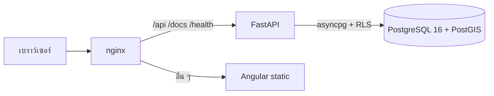

# สถาปัตยกรรมและแนวทางพัฒนา myAssets

เอกสารสำหรับนักพัฒนา: โครงสร้างระบบ กฎทางธุรกิจ และแนวทางเขียนโค้ด คู่มือผู้ใช้อยู่ที่ [user-guide/README.md](user-guide/README.md)

## ภาพรวม



| ชั้น | เทคโนโลยี |
| --- | --- |
| Frontend | Angular 22 (zoneless, signals, standalone, OnPush), Syncfusion 32.2.3 Material 3, Tailwind CSS v4, Sass |
| Backend | Python 3.12, FastAPI, SQLAlchemy 2 async, asyncpg, GeoAlchemy2, Alembic, PyJWT, argon2, openpyxl |
| Database | PostgreSQL 16 + PostGIS, Row-Level Security แยกข้อมูลตามกลุ่มลูกค้า |
| Deploy | Docker Compose: `nginx`, `frontend`, `api`, `db` |

## โครงสร้างไฟล์

```
backend/
  app/
    domain/          entities, enums, errors, ports (Protocol), rules.py (state machine + สิทธิ์)
    application/     use case ต่อโดเมน: inventory, device_import, customers, admin (รวม suppliers), auth, dashboard, reports
    infrastructure/  db (models, repositories, session), security (JWT/argon2), spreadsheet, seed
    presentation/    routers.py (/api/v1), schemas.py (Pydantic), deps.py, errors.py
  alembic/versions/  migration ตั้งชื่อ 000N_คำอธิบาย.py
  tests/             test_rules.py (unit), test_api_flow.py (ต่อ DB จริง)
frontend/src/
  app/core/          api.service (mutation), auth, guards, models, labels, device-actions, locale, theme
  app/layout/        shell (app bar + sidebar)
  app/pages/         หน้าตาม route (dashboard, reports, devices, scan, transactions, customers, installations, admin/*, profile, login)
  app/shared/        data-grid, dialogs, installation-map, page-header, empty/error state, stat-card, filter-chips, command-palette ...
  styles/            _tokens.scss, _mixins.scss (ใช้ด้วย @use 'tokens')
  tailwind.css       Tailwind + import CSS ของ Syncfusion เข้า cascade layer
  styles.scss        brand tokens, คลาส global, override ของ Syncfusion
docs/                เอกสารนี้ + คู่มือผู้ใช้
```

## Backend

### การไหลของคำขอ

`router` → `deps` (ถอด JWT เป็น `Actor`, เปิด `SqlUnitOfWork`) → use case ใน `application/` → `domain/rules.py` ตรวจสิทธิ์และสถานะ → repository → commit ก่อนส่ง response

- Router บางเสมอ: รับ schema แล้วเรียก use case หนึ่งตัว ไม่มี business logic
- Use case รับ `(uow, actor, ...)` และคืน read model (`DeviceView` ฯลฯ)
- Error ทางธุรกิจ raise เป็น `DomainError` ย่อย ข้อความภาษาไทยสำหรับผู้ใช้ แล้ว `presentation/errors.py` แปลงเป็น HTTP: 401 `AuthenticationError`, 403 `PermissionDeniedError`, 404 `NotFoundError`, 409 `ConflictError`/`InvalidTransitionError`, 422 `ValidationError`

### Multi-tenancy (Row-Level Security)

- แอปเชื่อมต่อด้วย role `inventory_app` (ไม่ใช่เจ้าของตาราง) จึงอยู่ใต้ RLS เสมอ migration ใช้ `inventory_owner`
- `Database.scoped()` ตั้ง `app.role` และ `app.tenant_id` ด้วย `set_config(..., true)` ต่อ transaction ทุกคำขอ policy ในแต่ละตารางกรองตามค่านี้
- ผลคือผู้ใช้กลุ่มลูกค้าไม่เห็นข้อมูลกลุ่มอื่นแม้ query จะลืมกรอง ซีเรียลของกลุ่มอื่นจะตอบเป็น "ไม่พบ"
- `Actor.resolve_tenant()` บังคับผู้ใช้กลุ่มลูกค้าให้ใช้ tenant ของตน ส่วน superadmin ต้องระบุเอง
- ตารางใหม่ที่มี `tenant_id` ต้อง `ENABLE ROW LEVEL SECURITY` และเพิ่ม policy ใน migration เดียวกัน

### วงจรชีวิตอุปกรณ์

กำหนดใน `ALLOWED_TRANSITIONS` (`backend/app/domain/rules.py`) และสะท้อนฝั่งหน้าเว็บใน `frontend/src/app/core/device-actions.ts` ต้องแก้สองที่ให้ตรงกัน

| รายการ | จากสถานะ | ไปสถานะ | เงื่อนไขเพิ่ม |
| --- | --- | --- | --- |
| CHECK_IN | - | IN_STOCK | |
| TRANSFER | IN_STOCK | IN_STOCK | superadmin เท่านั้น |
| CHECK_OUT | IN_STOCK | CHECKED_OUT | ต้องอยู่ในกลุ่มลูกค้าแล้ว |
| INSTALL | CHECKED_OUT | INSTALLED | ต้องอยู่ในกลุ่มลูกค้า, ลูกค้าต้อง active, บันทึก installation + พิกัด |
| LOAN | IN_STOCK | ON_LOAN | ต้องอยู่ในกลุ่มลูกค้า, ต้องมี `due_date` (เก็บใน `devices.loan_due_date`) |
| RETURN | CHECKED_OUT, INSTALLED, ON_LOAN | UNDER_QC | ปิด installation ที่ active และล้าง `loan_due_date` |
| QC_PASS | UNDER_QC | IN_STOCK | |
| QC_FAIL | UNDER_QC | IN_REPAIR | ต้องมีเหตุผล |
| SEND_REPAIR | IN_STOCK, CHECKED_OUT, INSTALLED | IN_REPAIR | `supplier_id` ไม่บังคับ |
| REPAIR_DONE | IN_REPAIR | IN_STOCK | ต้องมี `qc_note` |
| RETIRE | IN_STOCK, IN_REPAIR, UNDER_QC | RETIRED | |
| EDIT | สถานะใดก็ได้ | สถานะเดิม | เขียนโดย `PATCH /devices/{id}` เมื่อมีฟิลด์เปลี่ยน note เก็บรายการฟิลด์ |

ทุกการเปลี่ยนสถานะ (และการแก้ไขข้อมูลเครื่อง) เขียน `inventory_transactions` หนึ่งแถวใน transaction เดียวกัน (`_record()` ใน `application/inventory.py`) สต็อกจึงคำนวณย้อนจากประวัติได้เสมอ

งานค้างบนแดชบอร์ด (`dashboard_summary`): `pending_qc` = จำนวน UNDER_QC, `loan_overdue` = ON_LOAN ที่ `loan_due_date` ผ่านไปแล้ว, `repair_aging` = IN_REPAIR ที่ transaction ล่าสุดเก่ากว่า 14 วัน

ลูกค้าไม่ถูกลบจริง: `DELETE /customers/{id}` ตั้ง `is_active = false` (ConflictError ถ้ายังมี installation ที่ active) และ `PATCH is_active=true` เพื่อเปิดใช้ใหม่

`suppliers` เป็นตารางระดับแพลตฟอร์ม (ไม่มี `tenant_id` แบบเดียวกับ `device_models`) ทุกคนอ่านได้ เขียนได้เฉพาะ superadmin และลบไม่ได้ถ้ามี transaction อ้างถึง

สิทธิ์: `WRITE_ROLES` = superadmin, tenant_admin, staff; `ADMIN_ROLES` = superadmin, tenant_admin; `viewer` อ่านอย่างเดียว

### API

ทุก endpoint อยู่ใต้ `/api/v1` เอกสาร OpenAPI ที่ `/docs`

| กลุ่ม | Endpoint |
| --- | --- |
| auth | `POST /auth/login`, `/auth/refresh`, `/auth/change-password`, `GET /auth/me` |
| tenants, users, device-models, suppliers | CRUD (tenants, device-models, suppliers เขียนได้เฉพาะ superadmin) |
| devices | `GET /devices?search=&status=&model_id=&sort=&skip=&take=`, `GET /devices/status-counts`, `GET /devices/by-serial/{serial}`, `GET/PATCH/DELETE /devices/{id}` (DELETE = ปลดระวาง) |
| inventory | `POST /inventory/check-in`, `check-out`, `transfer`, `loan`, `return`, `qc-pass`, `qc-fail`, `send-repair`, `repair-done`, `import?dry_run=`, `GET import/template`, `transactions`, `summary` |
| customers | `GET`, `POST`, `PATCH`, `DELETE` (= ระงับ) |
| installations | `GET /installations?active_only=`, `GET /installations/nearby?lat=&lng=&radius_m=` (PostGIS `ST_DWithin`, สูงสุด 500 กม.), `POST`, `PATCH` |
| dashboard | `GET /dashboard/summary` (การ์ดสถานะ, แนวโน้ม 7/30 วัน, งานค้าง) |
| reports | `GET /reports/stock-balance?include_retired=` (รุ่น × กลุ่มลูกค้า × สถานะ พร้อมรวมต้นทุน), `GET /reports/aging?status=` (วันในสถานะปัจจุบันนับจาก transaction ล่าสุด) |

Paging ของ `GET /devices`: ไม่ส่ง `take` จะคืนทุกแถว (ใช้ตอน export), ส่ง `take` (สูงสุด 500) กับ `skip` เพื่อแบ่งหน้า `sort` เป็นชื่อฟิลด์ใน `DEVICE_SORT_FIELDS` ใส่ `-` นำหน้าเพื่อเรียงมากไปน้อย (ค่าเริ่มต้น `-created_at`) และ header `X-Total-Count` บอกจำนวนแถวที่ตรงเงื่อนไขทุกครั้ง

`GET /inventory/transactions` กรองด้วย `device_id`, `date_from`, `date_to`, `transaction_type` (ส่งซ้ำได้หลายค่า), `user_id` และ `limit` (ค่าเริ่มต้น 500 สูงสุด 5,000)

นำเข้าไฟล์: `dry_run=true` ตรวจทุกแถวแล้วคืนผล, `dry_run=false` บันทึกแบบทั้งหมดหรือไม่บันทึกเลย จำกัด 2 MB / 1,000 แถว

### Migration

- สร้างไฟล์ `alembic/versions/000N_<ชื่อ>.py` โดย `down_revision` ชี้ไฟล์ก่อนหน้า
- เปลี่ยน enum ของสถานะหรือประเภทรายการ: แก้ CHECK constraint (ดู `0003_repair_status.py`, `0005_loan_qc.py`) และ enum ใน `domain/enums.py` และ `frontend/src/app/core/models.ts`
- ประวัติ: `0004_edit_audit` (ประเภท EDIT, `customers.is_active`), `0005_loan_qc` (ON_LOAN/UNDER_QC, LOAN/QC_PASS/QC_FAIL, `devices.loan_due_date`), `0006_suppliers` (ตาราง `suppliers`, `inventory_transactions.supplier_id`)
- container `api` รัน `alembic upgrade head` ทุกครั้งที่เริ่ม

## Frontend

### แนวทางคอมโพเนนต์

- Standalone + `ChangeDetectionStrategy.OnPush` + signals ทุกคอมโพเนนต์ ไม่มี NgModule ของแอป
- อ่านข้อมูลด้วย `httpResource()` (ผลอยู่ใน signal: `.value()`, `.isLoading()`, `.error()`, `.reload()`)
- เขียนข้อมูลผ่าน `ApiService` (คืน `Promise`) แล้ว `reload()` resource ที่เกี่ยวข้อง
- ฟอร์ม: signal ต่อฟิลด์ + `computed` สำหรับความถูกต้อง, ใช้ `FORM_IMPORTS` จาก `shared/syncfusion.ts` และ directive `[liveValue]` บน `ejs-textbox`/`ejs-textarea` (Syncfusion ส่งค่าเมื่อ blur เท่านั้น)
- แจ้งผลด้วย `NotifyService.success()/error(err)`, ยืนยันด้วย `ConfirmService.ask()`
- ตาราง: ใช้ `<app-data-grid>` (export Excel/PDF ฟอนต์ไทย, เลือกคอลัมน์, จำมุมมองตาม `perspectiveKey`, skeleton/empty/error)
  - `hideAtMedia` ต่อคอลัมน์ซ่อนคอลัมน์รองบนจอแคบ, `groupBy` + `aggregates` สำหรับรายงาน, `cellTemplates` ผ่าน `<ng-template gridCell="field">`
  - โหมด `[serverPaging]="true"`: grid ส่ง `(query)` = `{skip, take, sort, search}` ให้หน้าไปเรียก API เอง แล้วส่ง `[total]` (จาก `X-Total-Count`) และ `[exportAll]` (ฟังก์ชันโหลดทุกแถวตอน export) กลับมา ตัวกรองนอก grid (เช่นชิปสถานะ) ให้เรียก `firstPage()`
  - อย่าใส่ child directive แบบ dynamic (`@for` ใน `<e-aggregates>`) ใน grid เพราะ Syncfusion จะพัง ให้ส่งเป็น property แทน
- แผนที่: `<app-installation-map>` (Syncfusion Maps + OSM) รับ `pin`, `radiusKm` (วาดวงกลมและซูมพอดี), `pickable` แล้วส่ง `(pick)` เป็น `{latitude, longitude}` เหตุการณ์ `click` ของ Maps ไม่ทำงานกับ OSM tile จึงคำนวณพิกัดเองจาก DOM click ด้วย `getTileGeoLocation`
- ปุ่มทำรายการกับอุปกรณ์มาจาก `availableActions()` ใน `core/device-actions.ts` และ dialog กลาง `shared/device-action-dialogs.ts` (ใช้ร่วมหน้าอุปกรณ์และสถานีสแกน)
- ข้อความ UI เป็นภาษาไทย ป้ายสถานะ/ประเภทรายการอยู่ใน `core/labels.ts` คำแปล Syncfusion อยู่ใน `core/locale.ts`

### สไตล์

ลำดับ cascade (ต่ำ → สูง):

1. `@layer syncfusion.base` — `ej2-base` คอมไพล์จาก SCSS ใน `styles.scss` โดยปิดการโหลด Roboto
2. `@layer syncfusion.components` — CSS สำเร็จรูปของแต่ละแพ็กเกจ import ใน `tailwind.css`
3. `@layer utilities` — Tailwind จึงชนะ Syncfusion ได้โดยไม่ต้องสนใจ specificity
4. ไม่อยู่ใน layer — `styles.scss` และ style ของคอมโพเนนต์

หลักการ:

- สีมาจาก CSS variable ของ Syncfusion (`--color-sf-*` เก็บเป็น `r, g, b`) ใช้ `rgb(var(--color-sf-x))` หรือ `rgba(var(--color-sf-x), a)` ห้าม hex ตายตัว เพื่อให้ธีมมืดและสีแบรนด์ทำงาน
- ใน SCSS ใช้ `@use 'tokens' as *;` แล้วเรียก `sf(primary)`, `sf-a(primary, .4)` และ mixin จาก `mixins` (`card`, `card-hover`, `status-badge`, `mono`, `up`)
- สีแบรนด์ indigo เปลี่ยนที่ `:root` และ `:root.e-dark-mode` ใน `styles.scss` จุดเดียว
- Tailwind utility ใช้สีชุด M3 (`bg-surface`, `text-on-surface-variant`, `bg-primary-container` ...) และ `dark:` ผูกกับคลาส `.e-dark-mode`
- ปรับหน้าตา Syncfusion ด้วย `cssClass` หรือ SCSS ของคอมโพเนนต์ (`:host ::ng-deep`) หลีกเลี่ยง `!important` เพราะใน layer `!important` ของ Syncfusion จะชนะ
- ไม่ import Tailwind preflight (จะล้างสไตล์ของ Syncfusion)
- ฟอนต์ Sarabun โหลดใน `index.html` กราฟ/แผนที่ถูกบังคับเป็น Sarabun ใน `styles.scss`

## การทดสอบ

```bash
cd backend && uv run pytest               # test_api_flow ต้องมี DB ที่ migrate + seed แล้ว
cd frontend && npx ng build && npx ng test
```

`test_api_flow.py` สร้าง tenant/ผู้ใช้/รุ่นชั่วคราวแล้วลบเองเมื่อจบ ครอบคลุมสิทธิ์, RLS ข้ามกลุ่ม, วงจรชีวิต (รวมยืม/QC), ซ่อม, ผู้จำหน่าย, การระงับลูกค้า, ตัวกรองประวัติ, รายงาน, paging และนำเข้าไฟล์

## ข้อควรระวัง

- รหัสผ่านใน `.env` ใช้ตัวอักษร/ตัวเลขเท่านั้น เพราะถูกฝังใน connection URL
- `backend/.env` สำหรับรันนอก Docker ต้องใช้รหัสผ่านเดียวกับ `.env` ของ Docker และต่อ DB ที่ `127.0.0.1:5434` (ต้องเปิด DB ด้วย `docker-compose.dev.yml`)
- Syncfusion Sidebar: ใช้ `Push`/`Over` ไม่ใช้ `Auto` (Auto เปิดตัวเองทุก resize) และ margin ของเนื้อหาคุมด้วยคลาสใน `shell.scss`
- License Syncfusion: `npm run license:generate` เขียน `app-config.json` จาก `SYNCFUSION_LICENSE`
