# คู่มือการใช้งาน SmartAsset Analytics

ระบบบริหารคลังอุปกรณ์ (เครื่องสแกนหน้า/ลายนิ้วมือ ฯลฯ) ตั้งแต่รับเข้าคลัง โอนให้กลุ่มลูกค้า เบิกออก ติดตั้งที่หน้างาน ส่งซ่อม จนถึงปลดระวาง พร้อมประวัติทุกการเคลื่อนไหว

> ภาพประกอบทั้งหมดถ่ายจากระบบจริงที่ความละเอียด 1440×900 (มือถือ 390×844) ธีมสว่าง ด้วยบัญชี "ผู้ดูแลแพลตฟอร์ม" และข้อมูลตัวอย่าง (ดูหัวข้อ 14) เมนูและปุ่มที่เห็นอาจน้อยกว่านี้ตามบทบาทของผู้ใช้ ถ่ายภาพชุดนี้ใหม่ได้ทั้งหมดด้วย `node scripts/guide-screenshots.cjs` (วิธีใช้อยู่ที่หัวไฟล์)
>
> คู่มือฉบับ HTML อยู่ที่ `docs/user-guide/index.html` (เปิดในเบราว์เซอร์ได้ทันที มีสารบัญด้านข้าง ค้นหาหัวข้อ คลิกภาพเพื่อขยาย และสั่งพิมพ์เป็น PDF ได้) หลังแก้ไฟล์นี้ให้สร้างใหม่ด้วย `node scripts/guide-html.cjs`

## สารบัญ

1. [บทบาทผู้ใช้และสถานะอุปกรณ์](#1-บทบาทผู้ใช้และสถานะอุปกรณ์)
2. [เข้าสู่ระบบและหน้าจอหลัก](#2-เข้าสู่ระบบและหน้าจอหลัก)
3. [รับอุปกรณ์เข้าคลัง](#3-รับอุปกรณ์เข้าคลัง)
4. [วงจรชีวิตอุปกรณ์: โอน → เบิก → ติดตั้ง / ยืม](#4-วงจรชีวิตอุปกรณ์-โอน--เบิก--ติดตั้ง--ยืม)
5. [ส่งซ่อมและบันทึกผล QC](#5-ส่งซ่อมและบันทึกผล-qc)
6. [รับคืน ตรวจสอบ (QC) และปลดระวาง](#6-รับคืน-ตรวจสอบ-qc-และปลดระวาง)
7. [นำเข้าอุปกรณ์จากไฟล์ Excel/CSV](#7-นำเข้าอุปกรณ์จากไฟล์-excelcsv)
8. [สถานีสแกน](#8-สถานีสแกน)
9. [ความเคลื่อนไหวสต็อก](#9-ความเคลื่อนไหวสต็อก)
10. [ลูกค้าและจุดติดตั้ง/แผนที่](#10-ลูกค้าและจุดติดตั้งแผนที่)
11. [ตั้งค่า: รุ่นอุปกรณ์ ผู้จำหน่าย/ผู้ซ่อม กลุ่มลูกค้า ผู้ใช้งาน](#11-ตั้งค่า-รุ่นอุปกรณ์-ผู้จำหน่ายผู้ซ่อม-กลุ่มลูกค้า-ผู้ใช้งาน)
12. [รายงาน](#12-รายงาน)
13. [โปรไฟล์ ธีม และการใช้งานบนมือถือ](#13-โปรไฟล์-ธีม-และการใช้งานบนมือถือ)
14. [ข้อมูลตัวอย่างสำหรับทดลองใช้](#14-ข้อมูลตัวอย่างสำหรับทดลองใช้)
15. [ผลตรวจ UX/UI ระหว่างทำคู่มือ](#15-ผลตรวจ-uxui-ระหว่างทำคู่มือ)

---

## 1. บทบาทผู้ใช้และสถานะอุปกรณ์

| บทบาท | ทำอะไรได้ |
| --- | --- |
| ผู้ดูแลแพลตฟอร์ม | เห็นทุกกลุ่มลูกค้า โอนอุปกรณ์จากคลังกลาง จัดการกลุ่มลูกค้า รุ่นอุปกรณ์ และผู้ใช้ทั้งหมด |
| ผู้ดูแลกลุ่มลูกค้า | ทำรายการกับอุปกรณ์ในกลุ่มของตน และจัดการผู้ใช้ในกลุ่ม |
| เจ้าหน้าที่ | ทำรายการกับอุปกรณ์ในกลุ่มของตน (เบิก ติดตั้ง ส่งซ่อม ฯลฯ) |
| ผู้ดูข้อมูล | ดูข้อมูลได้อย่างเดียว |

อุปกรณ์แต่ละเครื่องมี 7 สถานะ และระบบจะแสดงเฉพาะปุ่มที่ทำได้ในสถานะปัจจุบัน เครื่องที่รับคืนทุกกรณีจะเข้าคิว "รอตรวจสอบ (QC)" ก่อนกลับเข้าคลัง

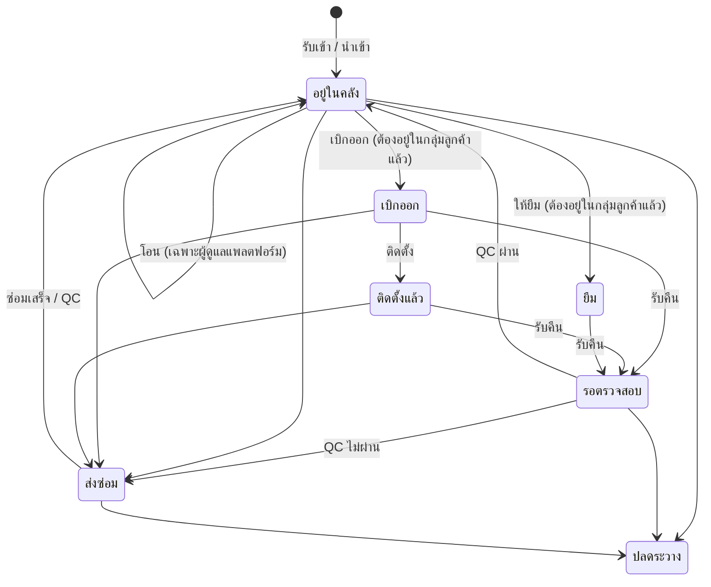
```mermaid
stateDiagram-v2
  [*] --> อยู่ในคลัง: รับเข้า / นำเข้า
  อยู่ในคลัง --> อยู่ในคลัง: โอน (เฉพาะผู้ดูแลแพลตฟอร์ม)
  อยู่ในคลัง --> เบิกออก: เบิกออก (ต้องอยู่ในกลุ่มลูกค้าแล้ว)
  อยู่ในคลัง --> ยืม: ให้ยืม (ต้องอยู่ในกลุ่มลูกค้าแล้ว)
  เบิกออก --> ติดตั้งแล้ว: ติดตั้ง
  เบิกออก --> รอตรวจสอบ: รับคืน
  ติดตั้งแล้ว --> รอตรวจสอบ: รับคืน
  ยืม --> รอตรวจสอบ: รับคืน
  รอตรวจสอบ --> อยู่ในคลัง: QC ผ่าน
  รอตรวจสอบ --> ส่งซ่อม: QC ไม่ผ่าน
  อยู่ในคลัง --> ส่งซ่อม
  เบิกออก --> ส่งซ่อม
  ติดตั้งแล้ว --> ส่งซ่อม
  ส่งซ่อม --> อยู่ในคลัง: ซ่อมเสร็จ / QC
  อยู่ในคลัง --> ปลดระวาง
  รอตรวจสอบ --> ปลดระวาง
  ส่งซ่อม --> ปลดระวาง
```

การแก้ไขข้อมูลเครื่อง (เช่น MAC ต้นทุน วันหมดประกัน) จะถูกบันทึกในประวัติเป็นรายการ "แก้ไขข้อมูล" พร้อมฟิลด์ที่เปลี่ยน โดยสถานะไม่เปลี่ยน

## 2. เข้าสู่ระบบและหน้าจอหลัก

### 2.1 เข้าสู่ระบบ

กรอกอีเมลและรหัสผ่าน แล้วกด **เข้าสู่ระบบ**

- กดไอคอน 👁 ท้ายช่องรหัสผ่านเพื่อแสดง/ซ่อนรหัสที่พิมพ์
- ติ๊ก **จดจำอีเมลบนเครื่องนี้** เพื่อให้กรอกอีเมลไว้ให้ในครั้งถัดไป (ไม่จำรหัสผ่าน)
- ปุ่ม ◐ มุมขวาบนสลับธีมสว่าง/มืดได้ตั้งแต่หน้านี้
- ถ้าเปิดลิงก์ของระบบ (เช่น สแกน QR บนฉลากอุปกรณ์) ขณะยังไม่ได้เข้าสู่ระบบ หน้านี้จะขึ้นว่า "เข้าสู่ระบบเพื่อไปยังหน้าที่คุณเปิดไว้" และพากลับไปหน้านั้นหลังเข้าสู่ระบบ

บนจอกว้าง ด้านซ้ายแสดงภาพตัวอย่างแดชบอร์ดและจุดเด่นของระบบ (ตัวเลขในภาพเป็นตัวอย่าง ไม่ใช่ข้อมูลจริง) บนมือถือจะเห็นเฉพาะฟอร์ม

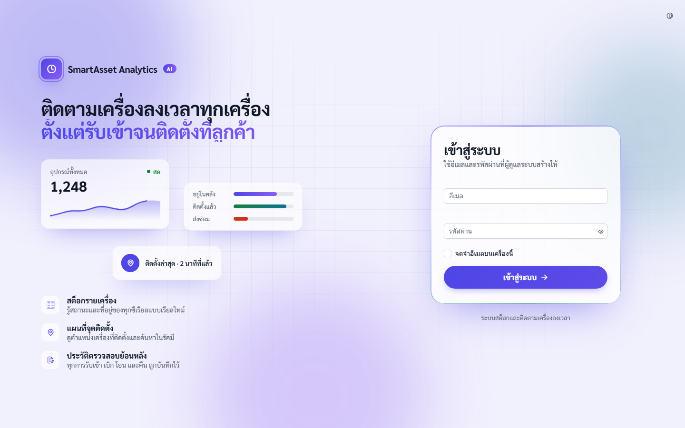

ถ้ารหัสผ่านผิดหรือบัญชีถูกระงับ ระบบจะแจ้งเตือนด้านบนฟอร์ม

### 2.2 แดชบอร์ด

หน้าแรกหลังเข้าสู่ระบบ แสดง

- การ์ดจำนวนอุปกรณ์ทั้งหมดและตามสถานะ พร้อมตัวเลขเปลี่ยนแปลงใน 7 วัน คลิกการ์ดเพื่อไปหน้าอุปกรณ์ที่กรองสถานะนั้นไว้แล้ว
- แผง **งานค้าง**: จำนวนเครื่องที่รอตรวจสอบ (QC), ยืมเกินกำหนดคืน และส่งซ่อมเกิน 14 วัน คลิกแต่ละรายการเพื่อดูเครื่องที่เกี่ยวข้อง (ถ้าไม่มีงานค้างจะขึ้น "ไม่มีงานค้าง")
- กราฟความเคลื่อนไหว 30 วัน สัดส่วนตามสถานะ และจำนวนตามรุ่น
- กิจกรรมล่าสุด คลิกซีเรียลเพื่อเปิดรายละเอียดเครื่อง (กด **ดูทั้งหมด** เพื่อไปหน้าความเคลื่อนไหวสต็อก)
- ปุ่มลัด **รับเข้า**, **นำเข้า**, **สแกน** และปุ่มรีเฟรช

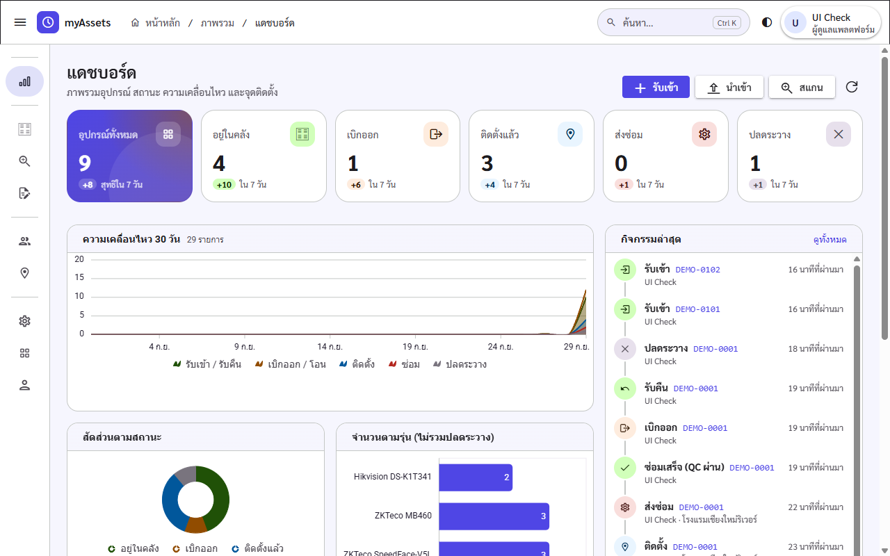

### 2.3 เมนูและการค้นหา

- ปุ่ม ☰ มุมซ้ายบนสลับเมนูแบบย่อ (ไอคอน) และแบบเต็ม ระบบจำค่าที่เลือกไว้

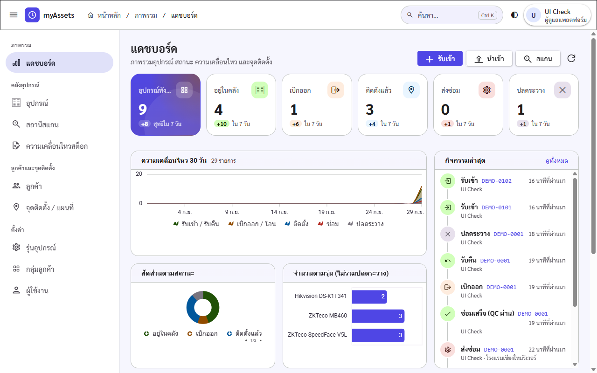

- ช่อง **ค้นหา...** ด้านบน (หรือกด `Ctrl K`) ใช้กระโดดไปหน้าต่าง ๆ หรือค้นหาอุปกรณ์ด้วยซีเรียลได้ทันที

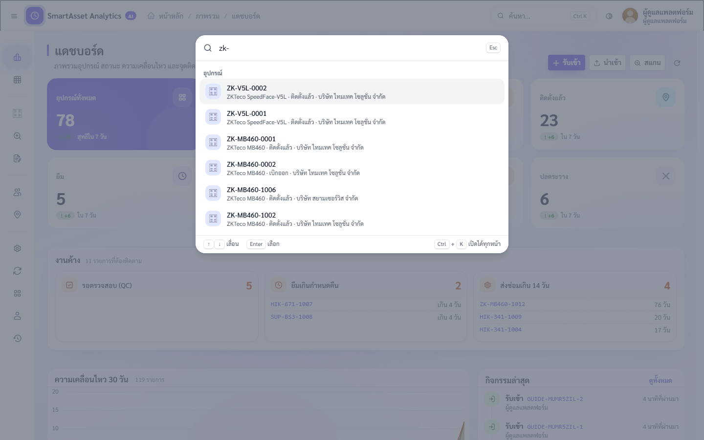

## 3. รับอุปกรณ์เข้าคลัง

เมนู **คลังอุปกรณ์ → อุปกรณ์** แสดงรายการทุกเครื่อง ใช้ชิปด้านบน (ทั้งหมด / อยู่ในคลัง / เบิกออก / …) ซึ่งบอกจำนวนเครื่องในแต่ละสถานะ เพื่อกรอง และใช้แถบเครื่องมือของตารางเพื่อส่งออก Excel/PDF เลือกคอลัมน์ หรือค้นหา (ค้นจากซีเรียล ยี่ห้อ รุ่น หรือ MAC)

ตารางโหลดข้อมูลทีละหน้าจากเซิร์ฟเวอร์ จึงเปิดได้เร็วแม้มีอุปกรณ์หลายหมื่นเครื่อง คลิกหัวคอลัมน์เพื่อเรียงลำดับ และเลือกจำนวนรายการต่อหน้าได้ที่มุมล่างซ้าย ส่วนปุ่ม Excel/PDF จะส่งออกทุกเครื่องตามตัวกรองปัจจุบัน ไม่ใช่เฉพาะหน้าที่เห็น

คอลัมน์ **จัดการ** ท้ายตารางมีปุ่มไอคอน 👁 **ดูรายละเอียด** และ ✎ **แก้ไข** ของแถวนั้นโดยไม่ต้องเลือกแถวก่อน ตารางอื่น ๆ (ลูกค้า จุดติดตั้ง รุ่นอุปกรณ์ ผู้จำหน่าย กลุ่มลูกค้า ผู้ใช้งาน) มีปุ่มชุดเดียวกัน ปุ่ม "ดู" เปิดหน้าต่างสรุปข้อมูลแบบอ่านอย่างเดียว ซึ่งกด **แก้ไข** ต่อได้ถ้ามีสิทธิ์ ปุ่มแก้ไขจะไม่แสดงสำหรับผู้ใช้ที่ไม่มีสิทธิ์แก้ไขข้อมูลนั้น

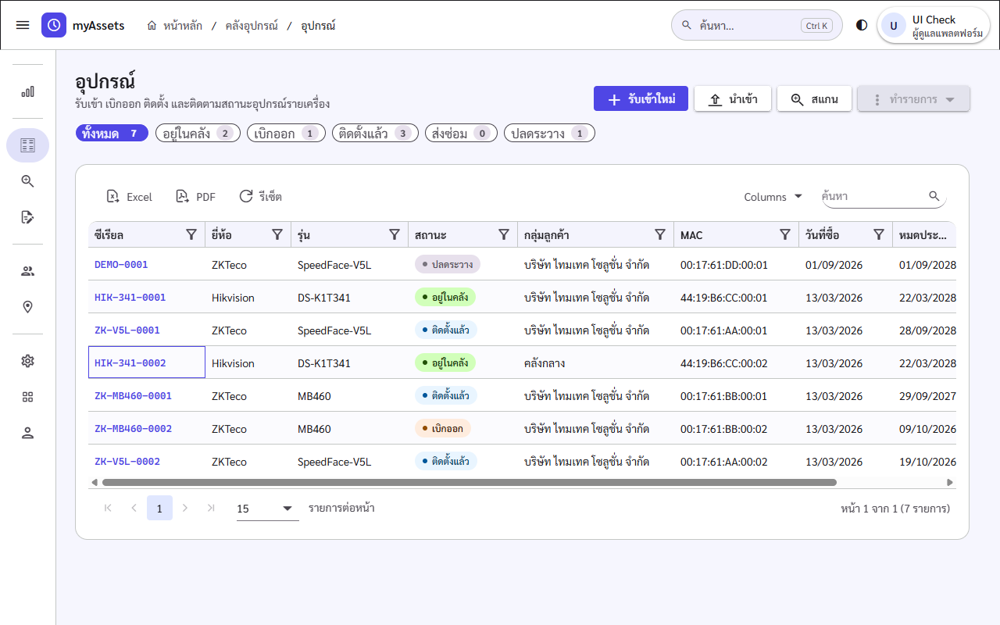

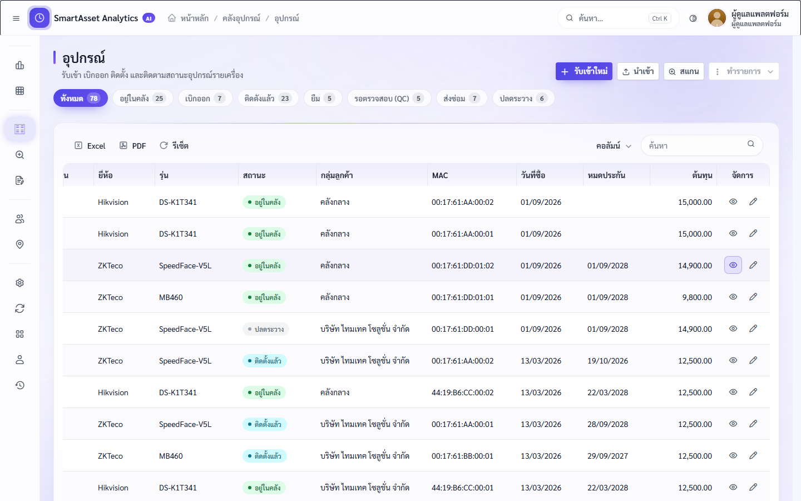

กด **รับเข้าใหม่** แล้วกรอก

- **หมายเลขซีเรียล** และ **รุ่นอุปกรณ์** (จำเป็น)
- **กลุ่มลูกค้า** — เว้นว่างไว้ถ้ารับเข้าคลังกลาง
- MAC Address, ต้นทุน, วันที่ซื้อ, วันสิ้นสุดประกัน, หมายเหตุ (ไม่บังคับ)
- **รหัสทรัพย์สิน** (ห้ามซ้ำภายในกลุ่มลูกค้าเดียวกัน), **เฟิร์มแวร์** และ **ซื้อจากผู้จำหน่าย** (ไม่บังคับ; ไฟล์นำเข้ามีคอลัมน์รหัสทรัพย์สินด้วย)

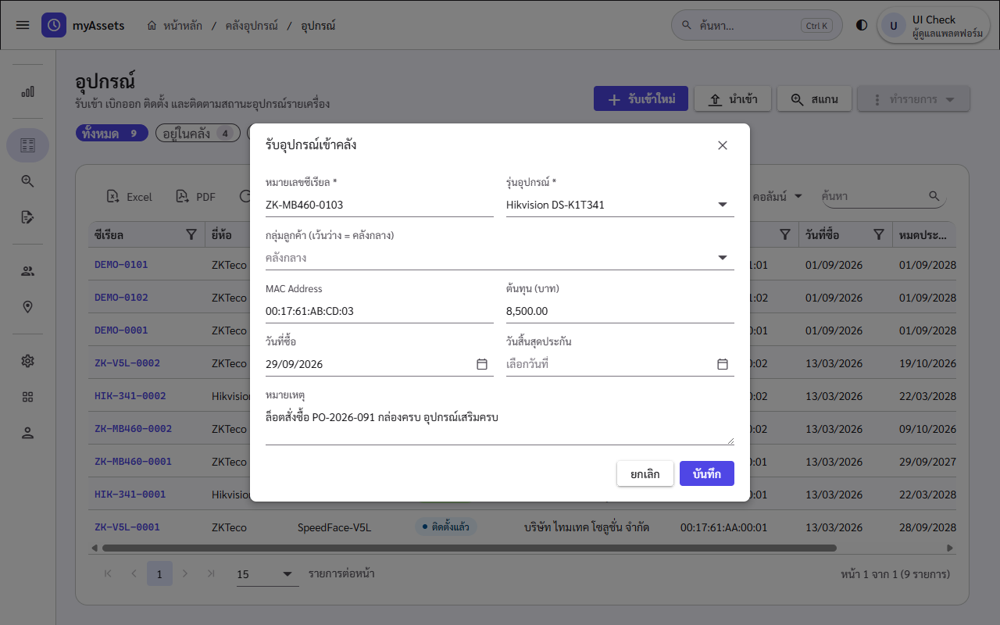

กด **บันทึก** เครื่องจะอยู่ในสถานะ "อยู่ในคลัง" และมีประวัติ "รับเข้า"

## 4. วงจรชีวิตอุปกรณ์: โอน → เบิก → ติดตั้ง / ยืม

คลิกซีเรียลในตารางเพื่อเปิดแผงรายละเอียดด้านขวา แผงนี้แสดงข้อมูลเครื่อง สถานะประกัน ปุ่มทำรายการตามสถานะ และประวัติความเคลื่อนไหว ปุ่มที่หัวแผงคือ ✎ แก้ไขข้อมูล, 🖨 พิมพ์ฉลาก (หัวข้อ 4.6), ⧉ คัดลอกลิงก์ของเครื่อง และ ✕ ปิด

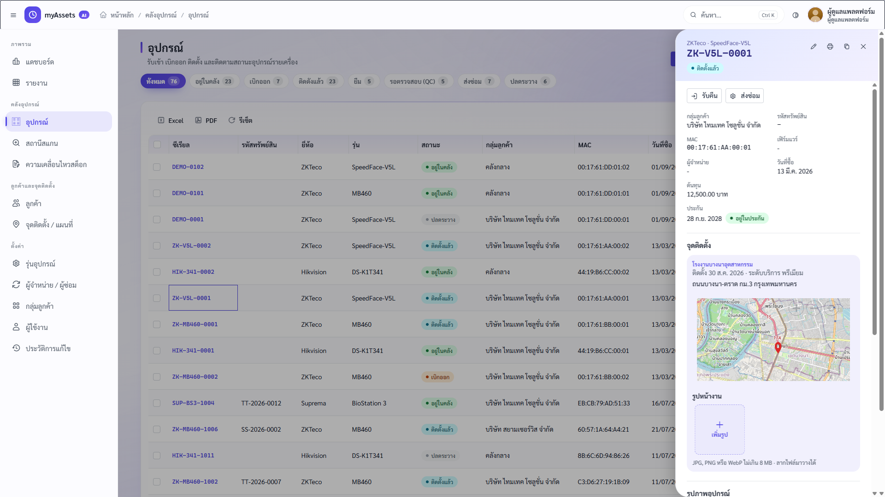

**รูปภาพอุปกรณ์:** ส่วน "รูปภาพอุปกรณ์" ในแผงรายละเอียดเก็บรูปของเครื่องได้หลายรูป (สูงสุด 20 รูป) กดช่อง **เพิ่มรูป** หรือลากไฟล์มาวาง (JPG, PNG, WebP ไม่เกิน 8 MB ต่อรูป) ระบบย่อขนาดและทำภาพตัวอย่างให้อัตโนมัติ คลิกรูปเพื่อดูขนาดใหญ่ เลื่อนดูรูปก่อนหน้า/ถัดไป เปิดขนาดเต็ม หรือ **ลบรูปนี้** (ผู้ใช้บทบาทดูอย่างเดียวดูรูปได้แต่เพิ่ม/ลบไม่ได้)

### 4.1 โอนให้กลุ่มลูกค้า (ผู้ดูแลแพลตฟอร์ม)

กด **โอน** เลือก **ปลายทาง** (รายการจะไม่แสดงตำแหน่งที่เครื่องอยู่ตอนนี้) และใส่หมายเหตุ แล้วกด **ยืนยัน**

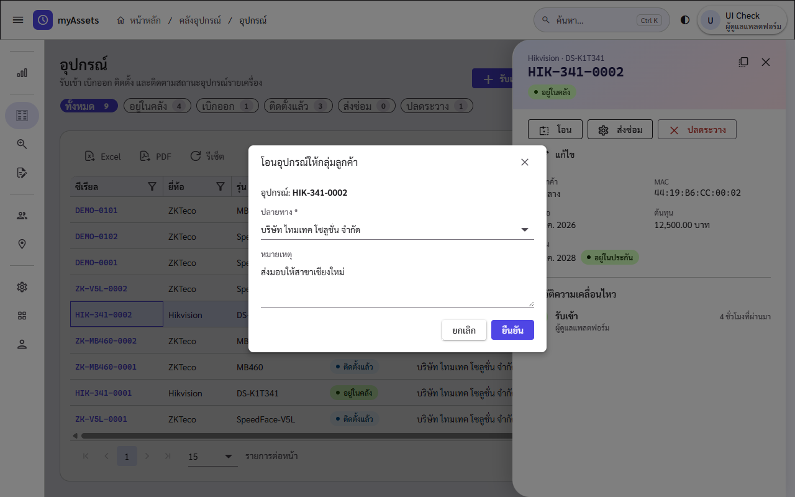

### 4.2 เบิกออก

เมื่อเครื่องอยู่ในคลังของกลุ่มลูกค้าแล้ว กด **เบิกออก** ใส่หมายเหตุ (เช่น เบิกให้ช่างคนไหน) แล้วกด **ยืนยัน**

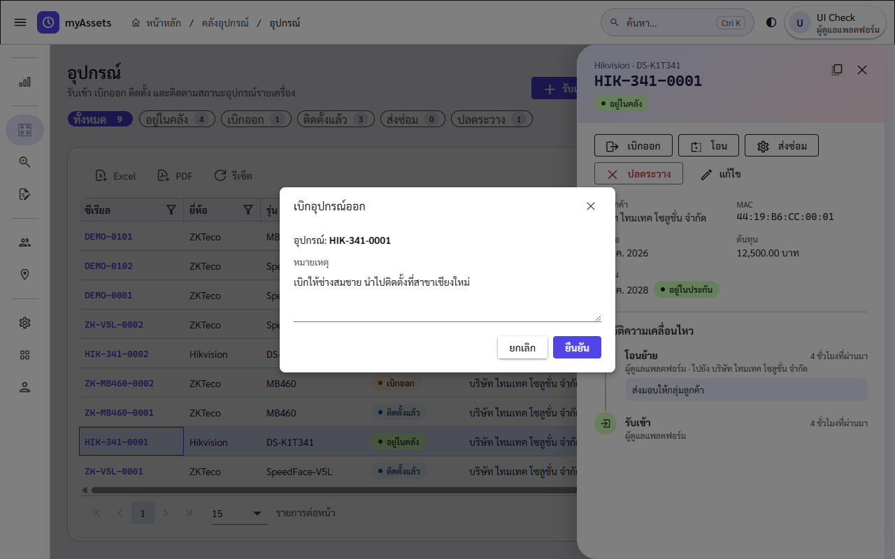

### 4.3 บันทึกการติดตั้ง

กด **ติดตั้ง** แล้วเลือก **ลูกค้า** วันที่ติดตั้ง และตำแหน่ง โดยคลิกบนแผนที่เพื่อปักหมุด (ซูมและลากแผนที่ได้ก่อนคลิก) ระบบจะกรอกละติจูด/ลองจิจูดให้ หรือกด **ใช้ตำแหน่งปัจจุบัน** เมื่ออยู่หน้างานเพื่อดึงพิกัดจาก GPS แล้วใส่ที่อยู่จุดติดตั้ง ผู้ติดต่อและโทรศัพท์หน้างาน และหมายเหตุการติดตั้ง (ไม่บังคับ) แนบ **รูปหน้างาน** ได้สูงสุด 10 รูปในไดอะล็อกเดียวกัน (ถ่ายจากมือถือได้ทันที) และเพิ่ม/ลบภายหลังได้ในส่วน "รูปหน้างาน" ของแผงรายละเอียดหรือหน้าจุดติดตั้ง

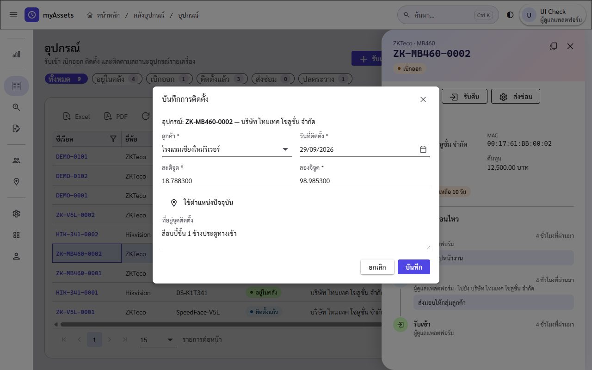

หลังบันทึก สถานะเป็น "ติดตั้งแล้ว" และแผงรายละเอียดแสดงลูกค้า จุดติดตั้ง และแผนที่

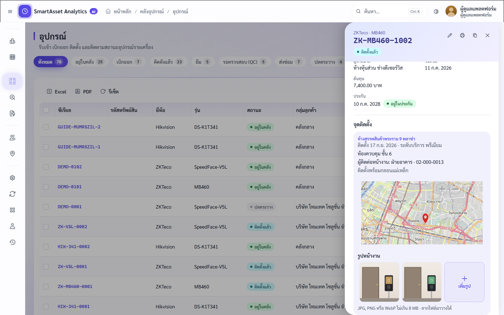

เลื่อนลงเพื่อดูประวัติทั้งหมดเรียงจากล่าสุด พร้อมผู้ทำรายการ หมายเหตุ และภาพตัวอย่างของรูปประกอบรายการ (คลิกเพื่อเปิดขนาดเต็ม)

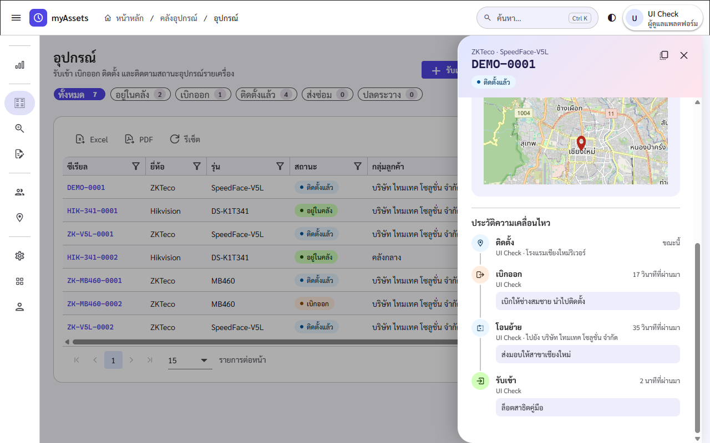

### 4.4 ให้ยืม

ใช้กับเครื่องที่อยู่ในคลังของกลุ่มลูกค้า เช่น ให้ลูกค้าทดลองใช้ กด **ให้ยืม** เลือก **วันครบกำหนดคืน** (จำเป็น) และระบุผู้ยืมหรือวัตถุประสงค์ แล้วกด **ยืนยัน**

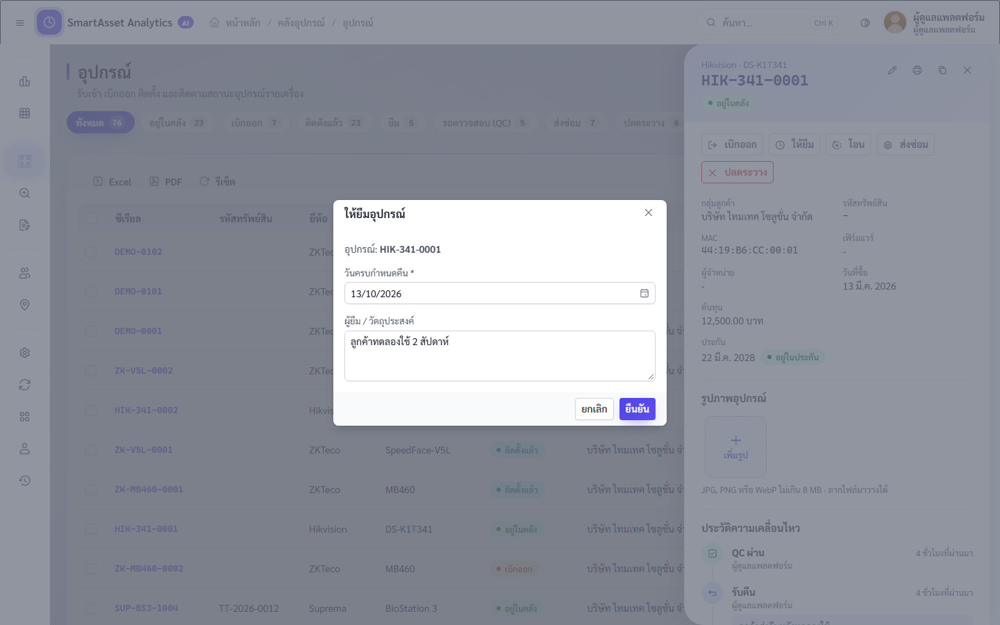

แผงรายละเอียดจะแสดงวันครบกำหนดคืนพร้อมจำนวนวันที่เหลือ (ชิปเปลี่ยนเป็นสีเหลืองเมื่อเหลือไม่เกิน 3 วัน และขึ้น "เกินกำหนด N วัน" เมื่อเลยกำหนด) และเครื่องที่ยืมเกินกำหนดจะขึ้นในแผงงานค้างบนแดชบอร์ด เมื่อได้เครื่องคืนให้กด **รับคืน** (ดูหัวข้อ 6)

### 4.5 ทำรายการหลายเครื่องพร้อมกัน

ติ๊กช่องหน้าแถวในตารางอุปกรณ์ (หรือช่องบนหัวตารางเพื่อเลือกทั้งหน้า) เมื่อเลือกตั้งแต่ 2 เครื่องขึ้นไป แถบคำสั่งจะลอยขึ้นที่ด้านล่างของจอ แสดงจำนวนที่เลือกและเฉพาะรายการที่ **ทุกเครื่อง** ทำได้ในสถานะปัจจุบัน เช่น เลือกเครื่องในคลังกลางหลายเครื่องจะเห็น **โอน**, **ส่งซ่อม**, **ปลดระวาง** ส่วนปุ่ม **พิมพ์ฉลาก** มีเสมอ และ **ล้าง** ยกเลิกการเลือก (ช่องติ๊กแสดงเฉพาะผู้ที่มีสิทธิ์ทำรายการ)

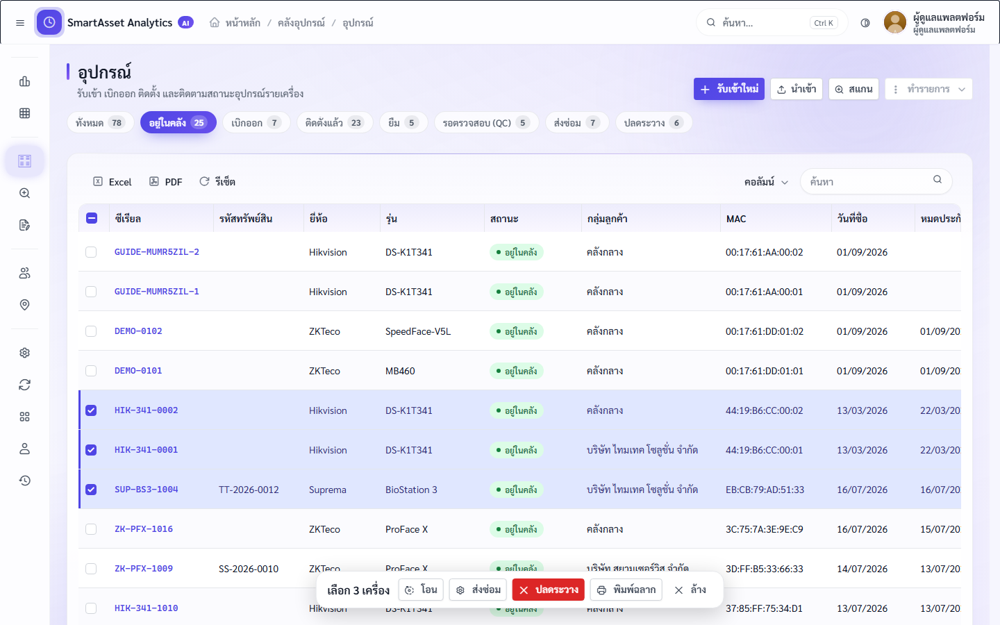

กดรายการที่ต้องการ ไดอะล็อกจะแสดงซีเรียลทุกเครื่องที่เลือก และช่องที่รายการนั้นต้องใช้ (ปลายทางสำหรับโอน ผู้ซ่อมสำหรับส่งซ่อม วันครบกำหนดสำหรับให้ยืม) หมายเหตุที่กรอกจะใช้กับทุกเครื่อง แล้วกด **ยืนยัน N เครื่อง**

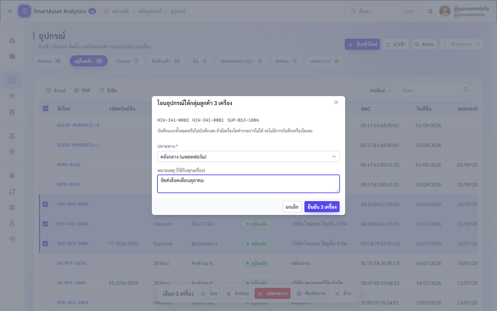

- ทำได้ครั้งละไม่เกิน 200 เครื่อง รายการที่รองรับคือ โอน เบิกออก ให้ยืม รับคืน QC ผ่าน ส่งซ่อม และปลดระวาง (การติดตั้งต้องทำทีละเครื่องเพราะแต่ละจุดมีพิกัดของตัวเอง)
- บันทึกแบบ **ทั้งหมดหรือไม่บันทึกเลย**: ถ้ามีเครื่องใดทำรายการไม่ได้ (เช่น มีคนเปลี่ยนสถานะไปก่อน) จะไม่มีเครื่องใดถูกบันทึก และไดอะล็อกจะแสดงซีเรียลพร้อมเหตุผลของแต่ละเครื่องให้แก้ไขแล้วลองใหม่
- แต่ละเครื่องยังได้ประวัติของตัวเองหนึ่งรายการเหมือนทำทีละเครื่อง

### 4.6 พิมพ์ฉลาก QR/บาร์โค้ด

กดไอคอน 🖨 ที่หัวแผงรายละเอียด (เครื่องเดียว) หรือปุ่ม **พิมพ์ฉลาก** ในแถบคำสั่งหลายเครื่องและในโหมดสแกนต่อเนื่อง (หัวข้อ 8) ฉลากแต่ละดวงมี

- **QR code** เป็นลิงก์ไปหน้าสถานีสแกนของเครื่องนั้น สแกนด้วยกล้องมือถือแล้วเปิดข้อมูลและปุ่มทำรายการได้ทันที (ถ้ายังไม่ได้เข้าสู่ระบบ จะเข้าสู่ระบบก่อนแล้วกลับมาหน้าเครื่องเอง)
- **บาร์โค้ด Code128** ของซีเรียล สำหรับเครื่องยิงบาร์โค้ด
- ซีเรียล ยี่ห้อ/รุ่น และรหัสทรัพย์สิน (ถ้ามี)

เลือกรูปแบบ **แผ่น A4 (3 × 8 ดวง, 70 × 37 มม.)** สำหรับกระดาษสติกเกอร์แบบแผ่น หรือ **ฉลากม้วน (ดวงละ 50 × 30 มม.)** สำหรับเครื่องพิมพ์ฉลาก ไดอะล็อกแสดงตัวอย่างสูงสุด 6 ดวงและจำนวนแผ่นที่ต้องใช้ แล้วกด **พิมพ์** ในหน้าต่างพิมพ์ของเบราว์เซอร์ให้ตั้งสเกล 100% (ขนาดจริง) และไม่มีขอบกระดาษ เพื่อให้ฉลากตรงช่องสติกเกอร์

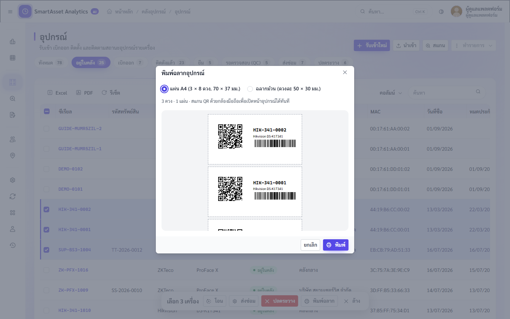

## 5. ส่งซ่อมและบันทึกผล QC

ไดอะล็อก **ส่งซ่อม**, **ซ่อมเสร็จ / QC**, **รับคืน**, **QC ผ่าน** และ **QC ไม่ผ่าน** มีช่อง **รูปประกอบ** แนบรูปอาการเสีย สภาพเครื่องตอนรับคืน หรือผลตรวจได้สูงสุด 10 รูป รูปจะผูกกับรายการนั้นและแสดงในประวัติความเคลื่อนไหว ถ้าอัปโหลดรูปไม่สำเร็จ รายการยังบันทึกตามปกติและระบบจะแจ้งเตือนให้ทราบ

### 5.1 ส่งซ่อม

กด **ส่งซ่อม** เลือก **ผู้ซ่อม / ผู้จำหน่าย** (เว้นว่างถ้าซ่อมเอง รายชื่อจัดการได้ที่หัวข้อ 11.2) แล้วระบุอาการหรือสาเหตุ

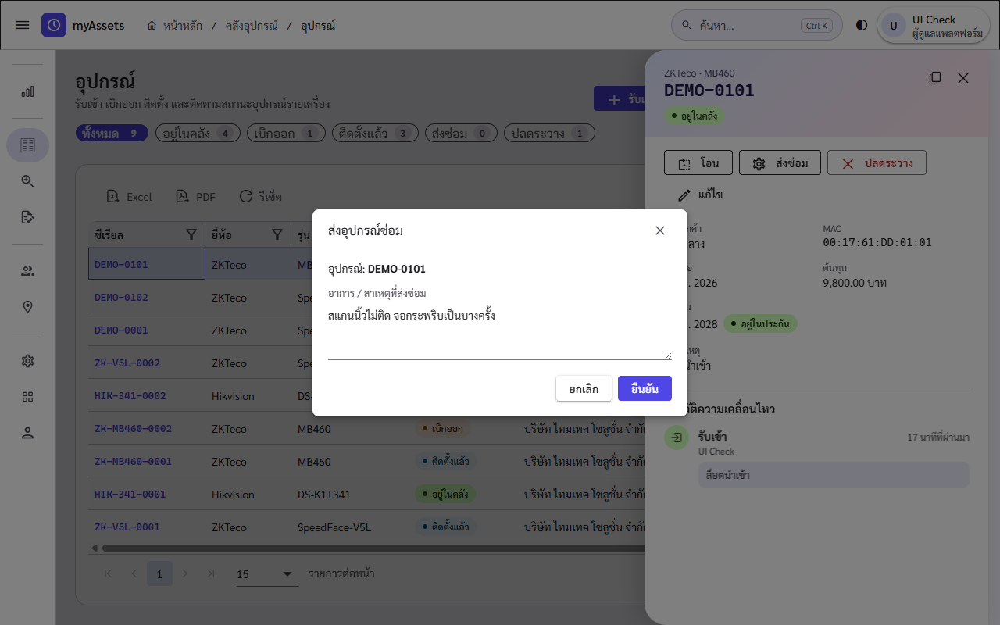

### 5.2 ซ่อมเสร็จ / QC

เมื่อได้เครื่องคืนจากซ่อม กด **ซ่อมเสร็จ / QC** และกรอก **ผลการซ่อมและ QC** (จำเป็น ปุ่มยืนยันจะกดได้เมื่อกรอกแล้ว)

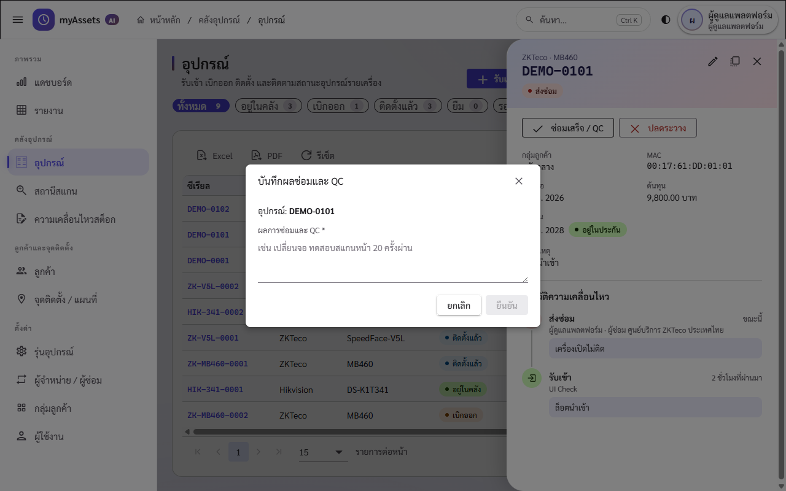

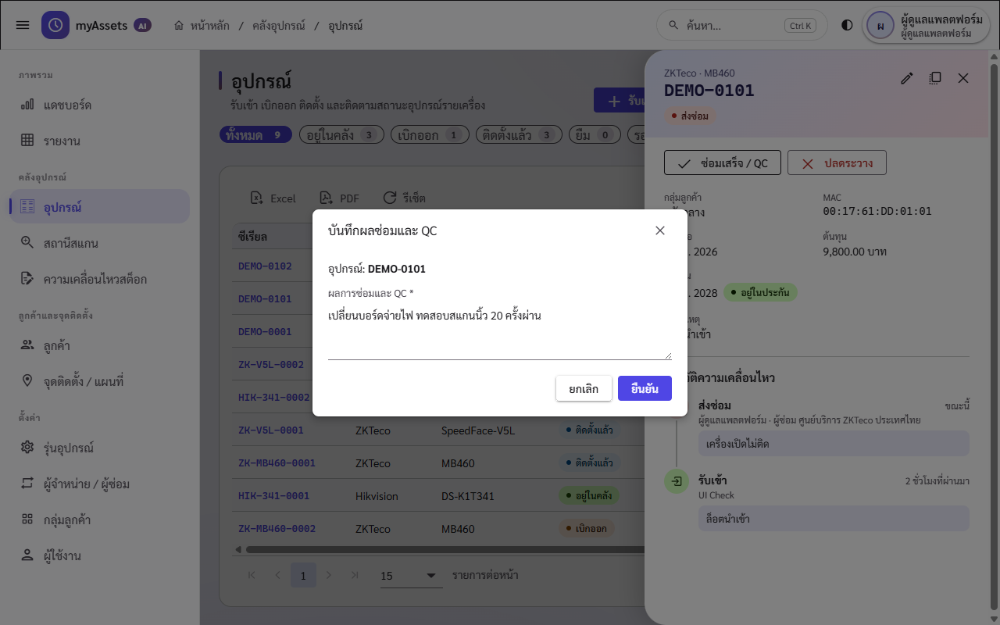

เครื่องจะกลับเป็น "อยู่ในคลัง" พร้อมเบิกใช้ใหม่ ถ้าส่งซ่อมนานเกิน 14 วันโดยยังไม่บันทึกผล เครื่องจะขึ้นในแผงงานค้างบนแดชบอร์ด

## 6. รับคืน ตรวจสอบ (QC) และปลดระวาง

### 6.1 รับคืน

ใช้กับเครื่องที่เบิกออก ติดตั้งแล้ว หรือให้ยืม กด **รับคืน** ใส่หมายเหตุแล้วกด **ยืนยัน** เครื่องจะเข้าสถานะ "รอตรวจสอบ (QC)" ยังไม่นับเป็นสต็อกพร้อมใช้จนกว่าจะบันทึกผล QC

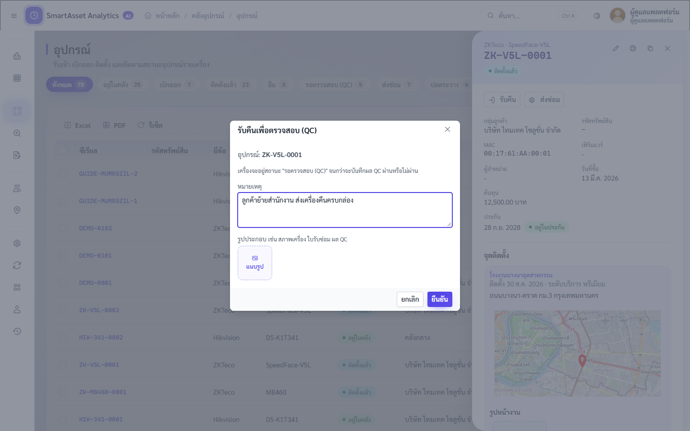

### 6.2 บันทึกผล QC

เครื่องที่รอตรวจสอบจะมีปุ่ม **QC ผ่าน** และ **QC ไม่ผ่าน** (ดูรายการที่รอได้จากชิป "รอตรวจสอบ (QC)" ในหน้าอุปกรณ์ หรือแผงงานค้างบนแดชบอร์ด และทำรายการจากสถานีสแกนได้เช่นกัน)

- **QC ผ่าน** — เครื่องกลับเป็น "อยู่ในคลัง" ใส่หมายเหตุได้ถ้าต้องการ
- **QC ไม่ผ่าน** — ต้องระบุอาการหรือสาเหตุ เครื่องจะเปลี่ยนเป็น "ส่งซ่อม" ทันที แล้วบันทึกผลซ่อมตามหัวข้อ 5.2

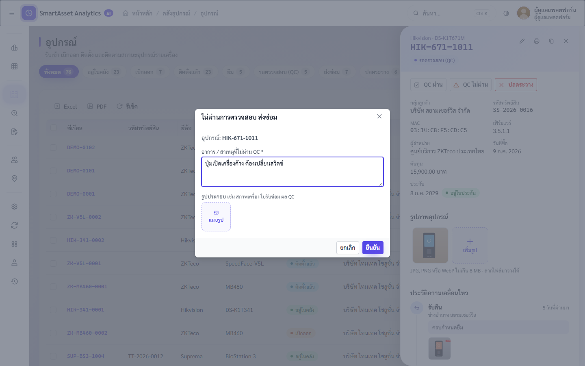

### 6.3 ปลดระวาง

ใช้กับเครื่องที่อยู่ในคลัง รอตรวจสอบ หรือส่งซ่อม เมื่อเลิกใช้งานถาวร ใส่เหตุผลแล้วกดปุ่มสีแดง **ยืนยัน** เครื่องจะไม่นับรวมในสต็อก แต่ประวัติยังอยู่

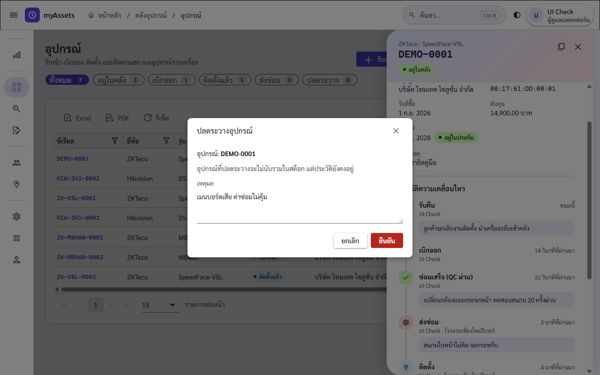

## 7. นำเข้าอุปกรณ์จากไฟล์ Excel/CSV

กด **นำเข้า** ที่หน้าอุปกรณ์หรือแดชบอร์ด

**ขั้นที่ 1 — เลือกไฟล์:** ดาวน์โหลด **ไฟล์แม่แบบ .xlsx** (มีคอลัมน์ ซีเรียล, รุ่น, MAC, วันที่ซื้อ, ต้นทุน, หมดประกัน, หมายเหตุ และแท็บรายชื่อรุ่น) กรอกข้อมูล แล้วลากไฟล์มาวางหรือกด **เลือกไฟล์** (รองรับ .xlsx / .csv ไม่เกิน 2 MB และไม่เกิน 1,000 แถว)

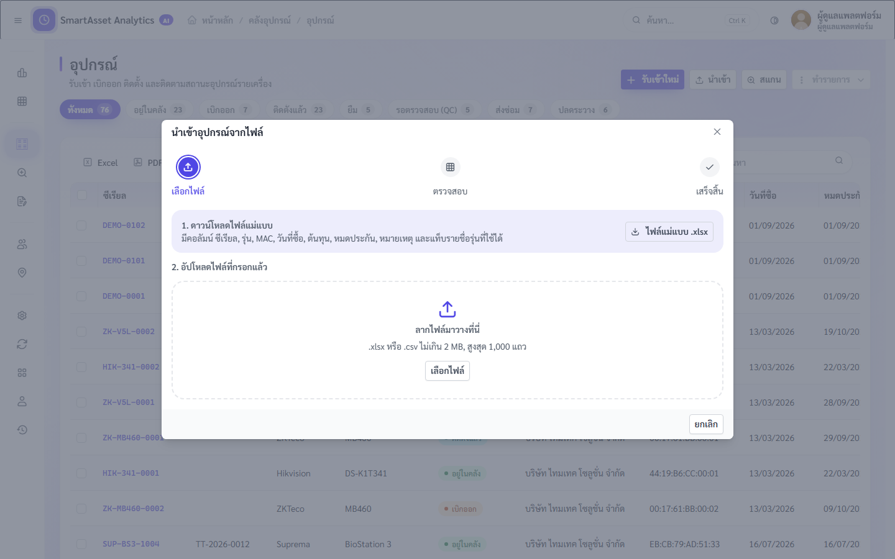

**ขั้นที่ 2 — ตรวจสอบ:** ระบบตรวจทุกแถวก่อนบันทึก แถวที่ผิดจะแสดงเหตุผล เช่น ซีเรียลซ้ำ ไม่พบรุ่น MAC ผิดรูปแบบ ติ๊ก **แสดงเฉพาะแถวที่ผิด** เพื่อดูเฉพาะแถวที่ต้องแก้ ระบบจะนำเข้าเมื่อทุกแถวถูกต้องเท่านั้น (ระหว่างนั้นปุ่มจะขึ้นว่า **แก้ไขแถวที่ผิดก่อน** และกดไม่ได้) ให้แก้ไฟล์แล้วกด **เลือกไฟล์ใหม่**

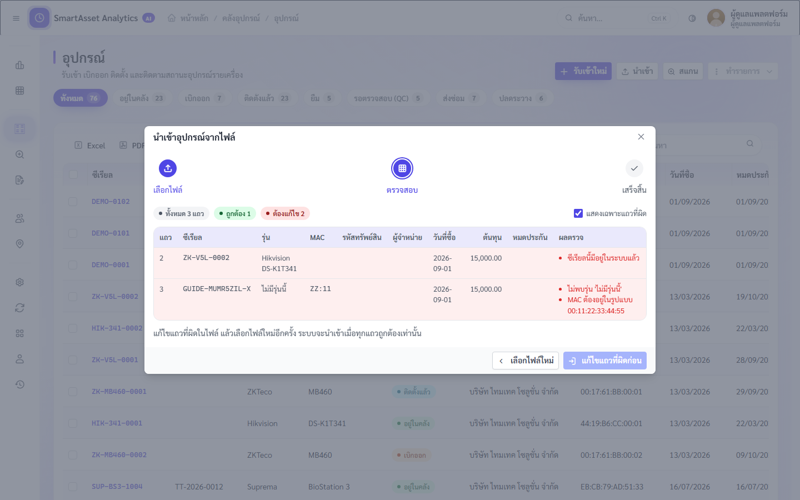

เมื่อทุกแถวผ่าน กด **นำเข้า N เครื่อง**

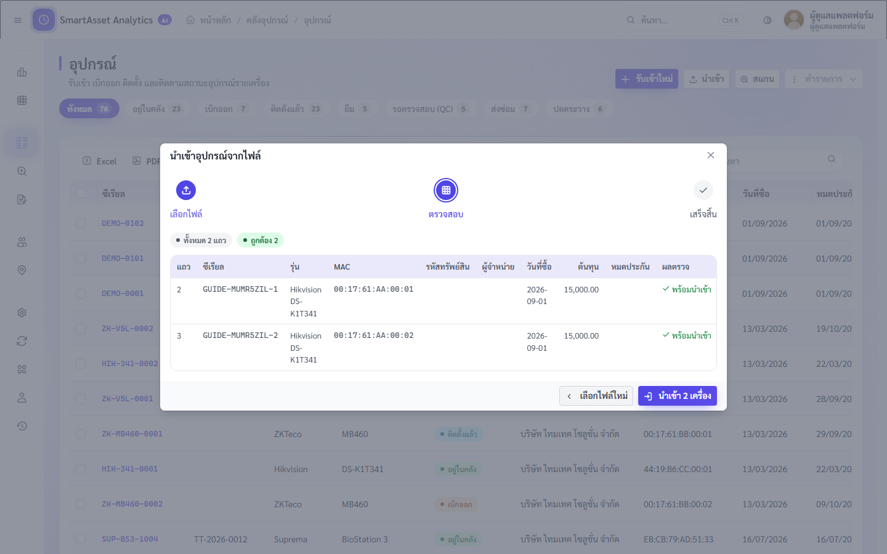

**ขั้นที่ 3 — เสร็จสิ้น:** ทุกเครื่องอยู่ในสถานะ "อยู่ในคลัง" และมีประวัติรับเข้า

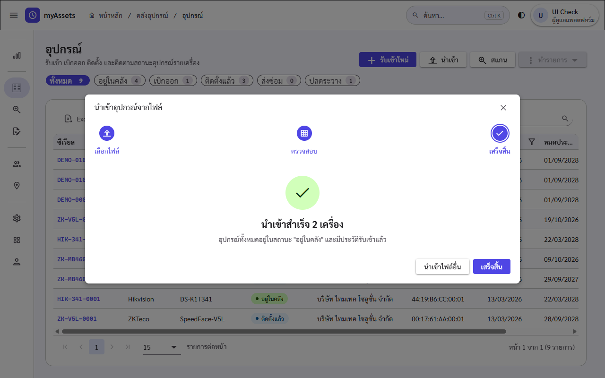

## 8. สถานีสแกน

เมนู **คลังอุปกรณ์ → สถานีสแกน** ออกแบบสำหรับเครื่องยิงบาร์โค้ด (ทำงานแบบคีย์บอร์ด ยิงแล้วกด Enter ให้อัตโนมัติ) หรือพิมพ์ซีเรียลเอง

- พบเครื่อง: แสดงสถานะ ตำแหน่ง และปุ่มทำรายการได้ทันที (รวมถึง **รับคืน**, **QC ผ่าน** / **QC ไม่ผ่าน** จึงใช้ตรวจรับเครื่องคืนทีละหลายเครื่องได้เร็ว) กด **รายละเอียด** เพื่อเปิดหน้าเครื่อง
- ด้านขวาเก็บประวัติการสแกนของรอบนี้ (กด **ล้าง** เพื่อเริ่มใหม่)

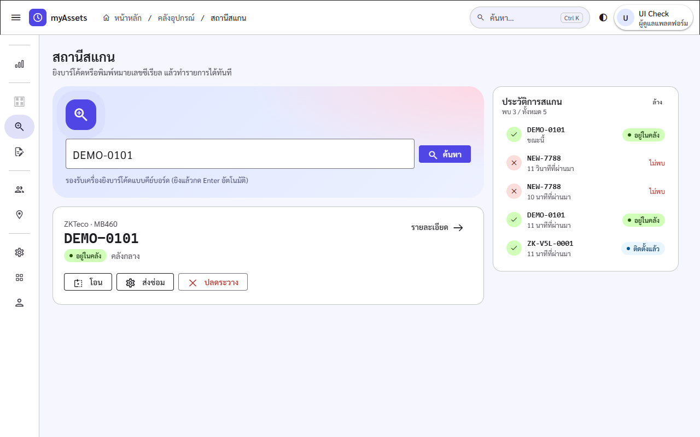

- ไม่พบเครื่อง: แจ้งชัดเจนและมีทางลัดให้รับเข้าเป็นเครื่องใหม่ด้วยซีเรียลนั้น

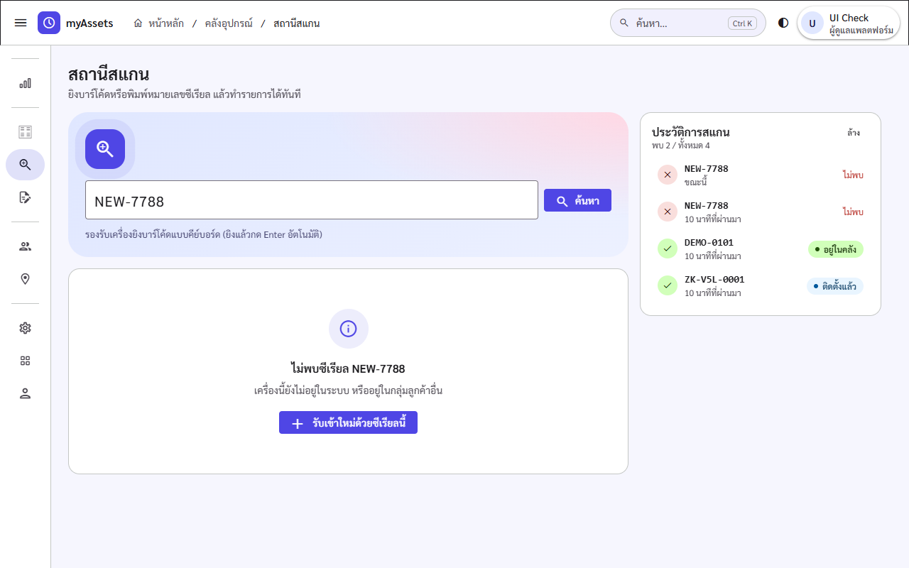

ช่องสแกนรับได้ทั้งซีเรียล (ตัวพิมพ์เล็กจะถูกแปลงเป็นตัวใหญ่ให้) และ QR บนฉลากของระบบ (หัวข้อ 4.6) ซึ่งเป็นลิงก์ ระบบจะดึงซีเรียลออกจากลิงก์ให้เอง

**โหมดสแกนต่อเนื่อง:** ติ๊ก **โหมดสแกนต่อเนื่อง** ใต้ช่องสแกน แล้วยิงไปเรื่อย ๆ เครื่องที่พบจะสะสมในกล่อง "รายการที่สแกนสะสม" (สแกนซ้ำไม่เพิ่มซ้ำ กด ✕ เพื่อเอาออกทีละเครื่อง หรือ **ล้าง** ทั้งหมด) ใต้รายการมีปุ่มทำรายการที่ทุกเครื่องในกล่องทำได้ พร้อมจำนวนเครื่อง เช่น **รับคืน (12)** หรือ **QC ผ่าน (12)** และปุ่ม **พิมพ์ฉลาก** กดแล้วใช้ไดอะล็อกและกติกาเดียวกับการทำรายการหลายเครื่องในหัวข้อ 4.5 เหมาะกับการตรวจรับเครื่องคืนหรือจัดส่งทั้งล็อต

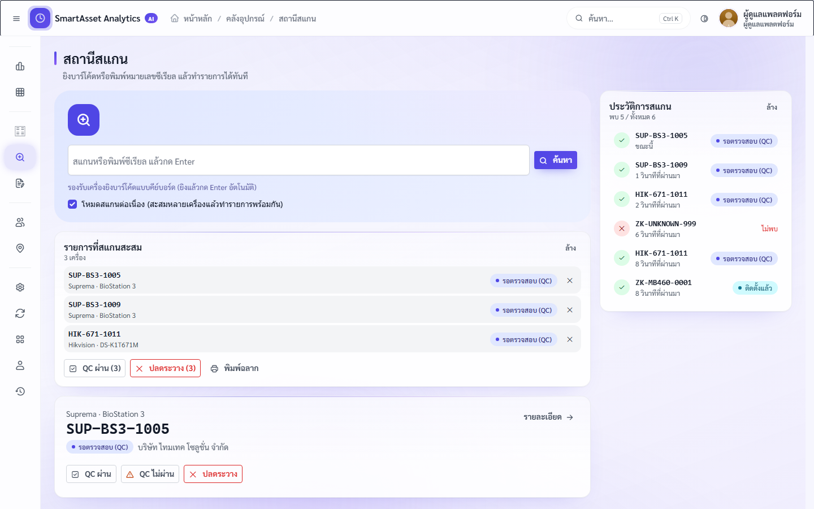

## 9. ความเคลื่อนไหวสต็อก

เมนู **คลังอุปกรณ์ → ความเคลื่อนไหวสต็อก** รวมทุกรายการที่เปลี่ยนสถานะ ย้าย หรือแก้ไขข้อมูลอุปกรณ์ พร้อมสถานะก่อนและหลัง กลุ่มลูกค้า ลูกค้า ผู้ซ่อม ผู้ทำรายการ และหมายเหตุ

- **ช่วงวันที่:** เลือกจากปฏิทินหรือทางลัด วันนี้ / 7 วันล่าสุด / 30 วันล่าสุด / เดือนนี้
- **ประเภทรายการ:** ใช้ชิป (รับเข้า โอนย้าย เบิกออก … แก้ไขข้อมูล) กรองเฉพาะประเภทที่ต้องการ
- กด **ล้างตัวกรอง** เพื่อกลับไปดูทั้งหมด ตัวกรองจะอยู่ในลิงก์ของหน้า จึงคัดลอก URL ส่งให้ผู้อื่นเปิดดูผลเดียวกันได้
- ค้นหาและส่งออก Excel/PDF ได้จากแถบเครื่องมือของตาราง

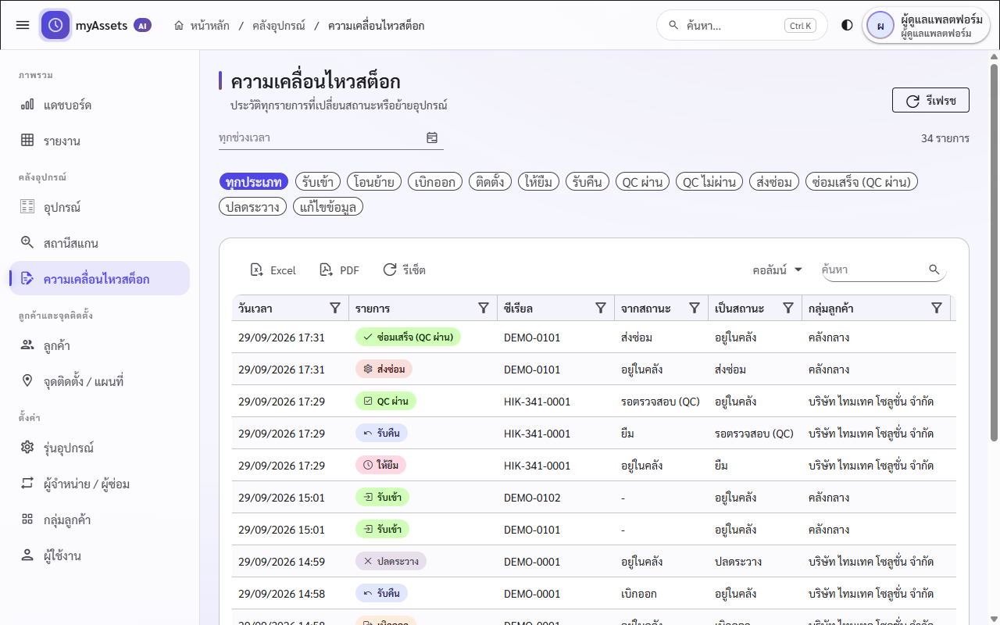

## 10. ลูกค้าและจุดติดตั้ง/แผนที่

### 10.1 ลูกค้า

เมนู **ลูกค้าและจุดติดตั้ง → ลูกค้า** จัดการบริษัทลูกค้าของแต่ละกลุ่ม พร้อมผู้ติดต่อและระดับบริการ ชิปด้านบนสลับดูลูกค้าที่ใช้งาน / ระงับ / ทั้งหมด

ลูกค้าจะไม่ถูกลบออกจากระบบเพื่อให้ประวัติการติดตั้งยังอ้างอิงได้ ให้เลือกแถวแล้วกด **ระงับ** แทน (ระงับไม่ได้ถ้ายังมีอุปกรณ์ติดตั้งอยู่ที่ลูกค้ารายนั้น) ลูกค้าที่ถูกระงับจะไม่แสดงในรายการตอนบันทึกการติดตั้ง และกด **เปิดใช้** เพื่อกลับมาใช้งานได้

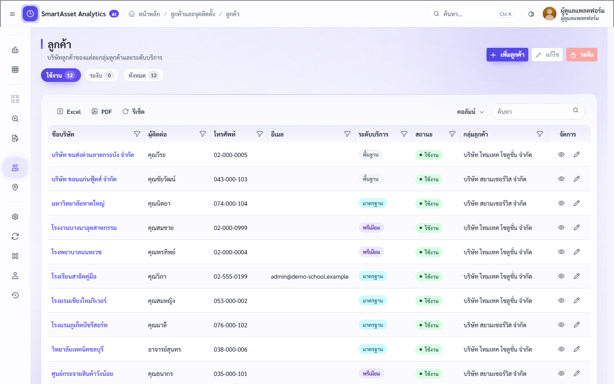

กด **เพิ่มลูกค้า** กรอกชื่อบริษัท กลุ่มลูกค้า ผู้ติดต่อ โทรศัพท์ อีเมล ระดับบริการ (พื้นฐาน / มาตรฐาน / พรีเมียม) และถ้ามี ที่อยู่ เลขประจำตัวผู้เสียภาษี (13 หลัก) และหมายเหตุ

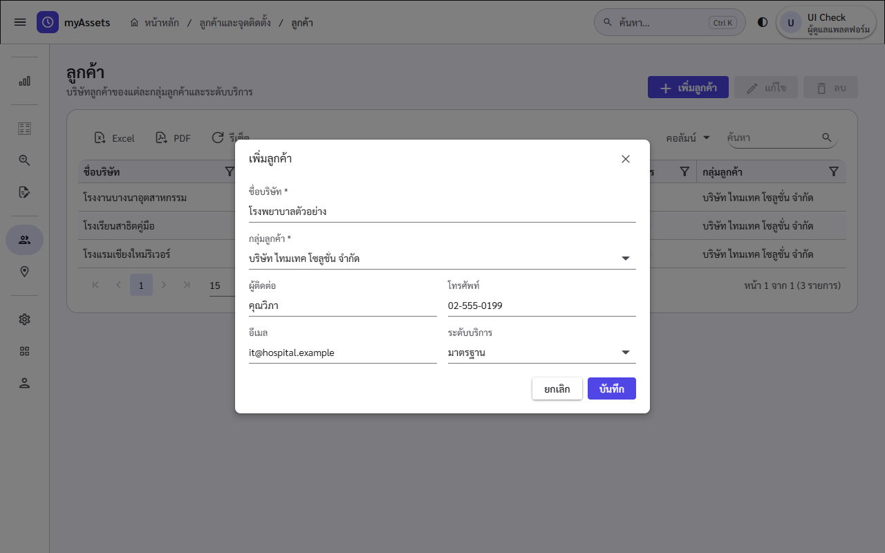

**หน้ารายละเอียดลูกค้า:** กด 👁 ในคอลัมน์จัดการ หรือคลิกชื่อลูกค้าในหน้าจุดติดตั้ง ความเคลื่อนไหวสต็อก และแผงรายละเอียดอุปกรณ์ เพื่อเปิดภาพรวมของลูกค้ารายนั้นในหน้าเดียว

- ข้อมูลติดต่อ ที่อยู่ และเลขผู้เสียภาษี
- การ์ดสรุป: จุดติดตั้งที่ใช้งาน, ติดตั้งทั้งหมด (รวมที่ถอนแล้ว), อยู่ในประกัน และอยู่ระหว่างซ่อม พร้อมชิปสถานะปัจจุบันของทุกเครื่องที่เคยติดตั้งให้ลูกค้ารายนี้
- แผนที่จุดติดตั้งที่ซูมพอดีทุกจุด และประวัติความเคลื่อนไหวของลูกค้า (ติดตั้ง รับคืน ส่งซ่อม พร้อมรูปประกอบ)
- ตารางจุดติดตั้งทั้งหมด (คลิกเพื่อเปิดอุปกรณ์) รูปหน้างานแยกตามจุด และประวัติการแก้ไขข้อมูลลูกค้า

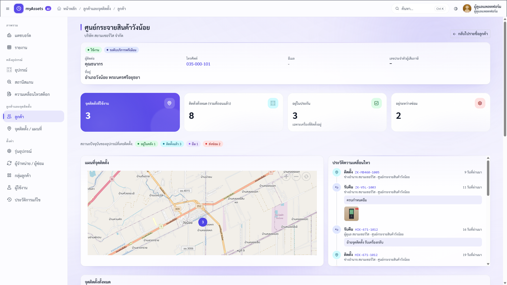

### 10.2 จุดติดตั้ง / แผนที่

แสดงทุกจุดติดตั้งบนแผนที่และในตาราง

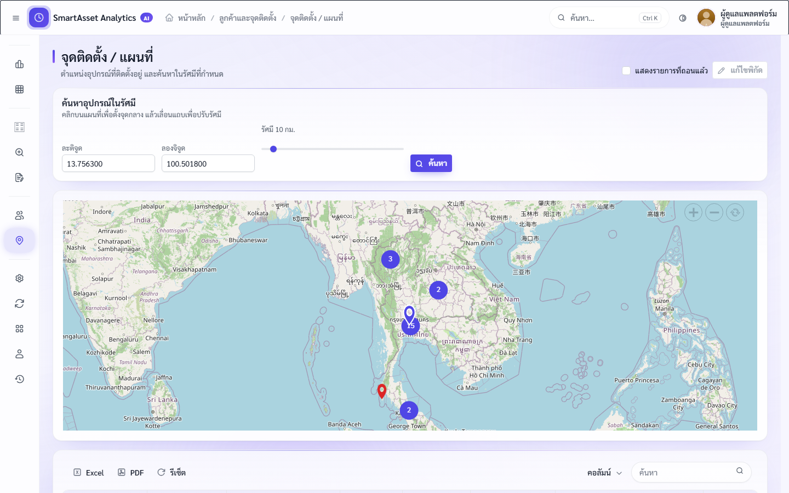

**ค้นหาอุปกรณ์ในรัศมี:** คลิกบนแผนที่เพื่อตั้งจุดกลาง (หรือพิมพ์ละติจูด/ลองจิจูด) เลื่อนแถบ **รัศมี** (1–100 กม.) แล้วกด **ค้นหา** แผนที่จะวาดวงกลมรัศมีและซูมให้พอดี ตารางด้านล่างแสดงเครื่องที่อยู่ในรัศมีพร้อมระยะทาง เมื่อค้นหาแล้ว การคลิกจุดใหม่หรือปรับรัศมีจะค้นหาใหม่ให้อัตโนมัติ กด **แสดงทั้งหมด** เพื่อกลับไปดูทุกจุด เหมาะสำหรับวางแผนงานช่างหน้างาน

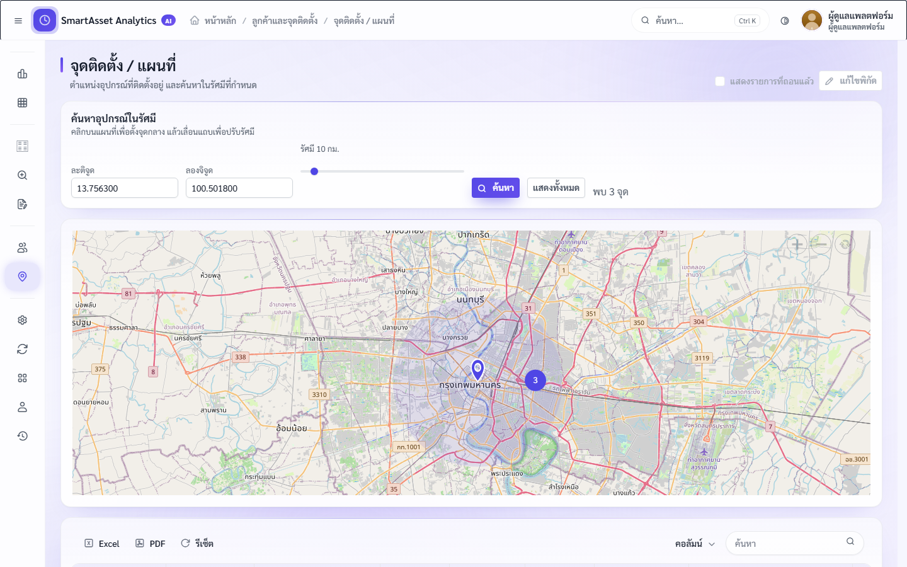

เลือกแถวแล้วกด **แก้ไขพิกัด** เพื่อย้ายหมุดของจุดติดตั้งด้วยการคลิกบนแผนที่ในไดอะล็อกได้เช่นกัน ปุ่ม 👁 ในคอลัมน์จัดการเปิดรายละเอียดจุดติดตั้งพร้อมแผนที่และ **รูปหน้างาน** ซึ่งเพิ่มหรือลบรูปได้จากตรงนั้น

## 11. ตั้งค่า: รุ่นอุปกรณ์ ผู้จำหน่าย/ผู้ซ่อม กลุ่มลูกค้า ผู้ใช้งาน

### 11.1 รุ่นอุปกรณ์

รายการยี่ห้อ/รุ่น/ประเภท ที่ใช้ตอนรับเข้าและในไฟล์นำเข้า คอลัมน์แรกแสดงรูปสินค้าของรุ่น ผู้ดูแลแพลตฟอร์มตั้งรูปได้จากปุ่ม 👁 → **รูปสินค้า** (รุ่นละ 1 รูป อัปโหลดใหม่จะแทนรูปเดิม)

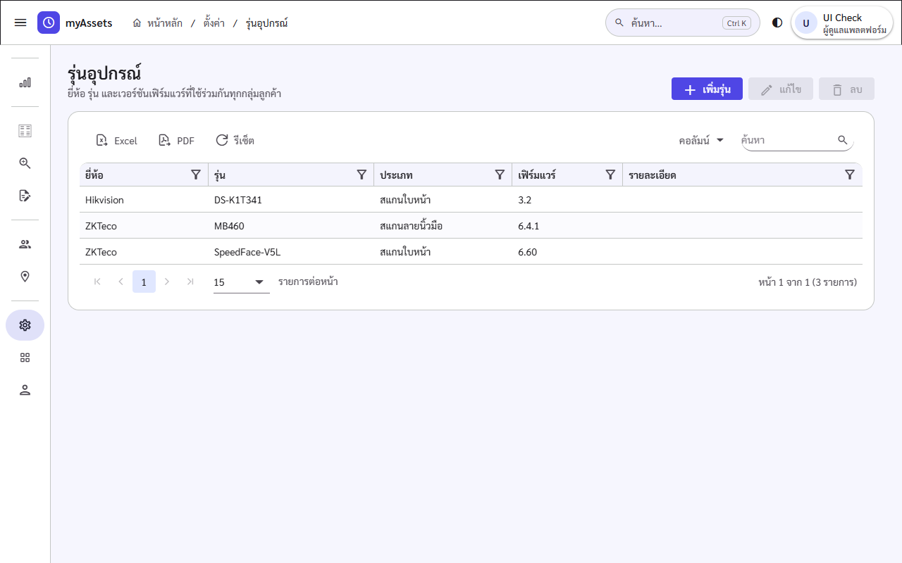

### 11.2 ผู้จำหน่าย / ผู้ซ่อม

รายชื่อร้านซ่อมและผู้จำหน่ายที่ใช้ร่วมกันทุกกลุ่มลูกค้า ใช้เลือกตอนส่งซ่อม และแสดงในคอลัมน์ "ผู้ซ่อม" ของความเคลื่อนไหวสต็อก กด **เพิ่มผู้จำหน่าย** แล้วกรอกชื่อ (จำเป็น) ผู้ติดต่อ โทรศัพท์ อีเมล และหมายเหตุ ผู้ดูแลแพลตฟอร์มเท่านั้นที่เพิ่ม แก้ไข หรือลบได้ (ลบไม่ได้ถ้าเคยถูกใช้ในรายการส่งซ่อมแล้ว)

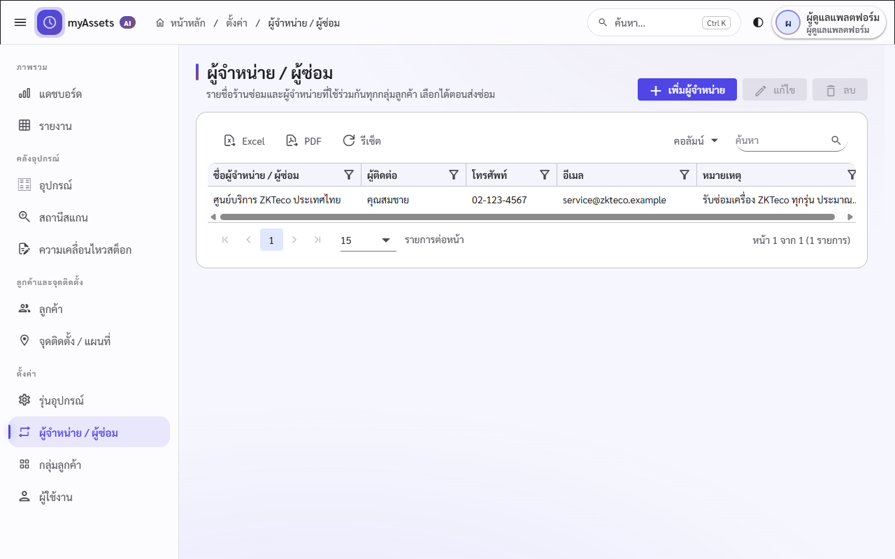

### 11.3 กลุ่มลูกค้า (เฉพาะผู้ดูแลแพลตฟอร์ม)

องค์กรที่ใช้ระบบ แต่ละกลุ่มเห็นเฉพาะอุปกรณ์และข้อมูลของตนเอง

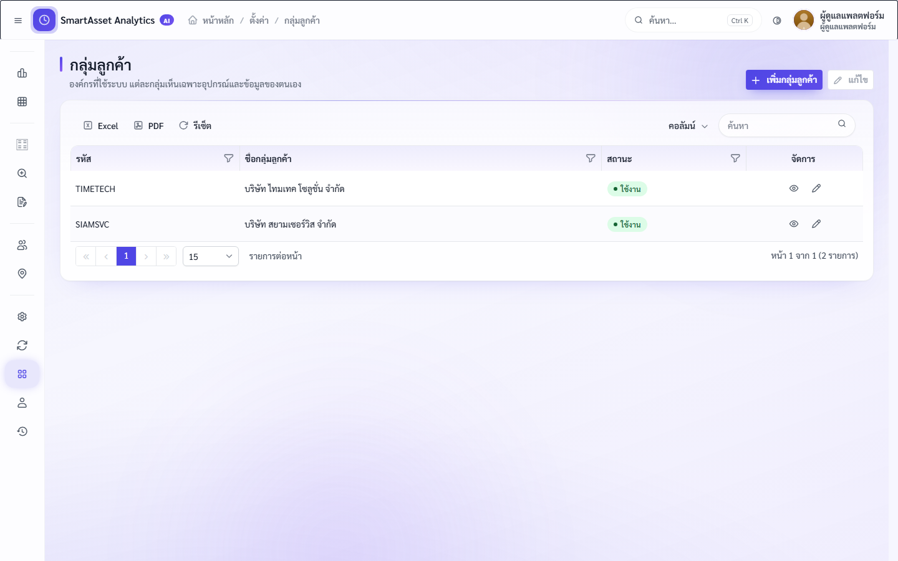

### 11.4 ผู้ใช้งาน

จัดการบัญชี บทบาท และการระงับใช้งาน คอลัมน์ชื่อแสดงรูปโปรไฟล์ของผู้ใช้ (ถ้าไม่มีรูปจะแสดงอักษรแรกของชื่อ)

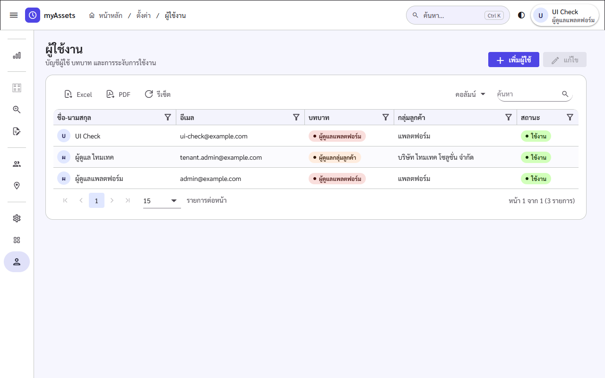

กด **เพิ่มผู้ใช้** กรอกชื่อ อีเมล บทบาท รหัสผ่าน (อย่างน้อย 8 ตัว) และกลุ่มลูกค้า ปุ่ม **บันทึก** จะกดได้เมื่อกรอกช่องจำเป็นครบ

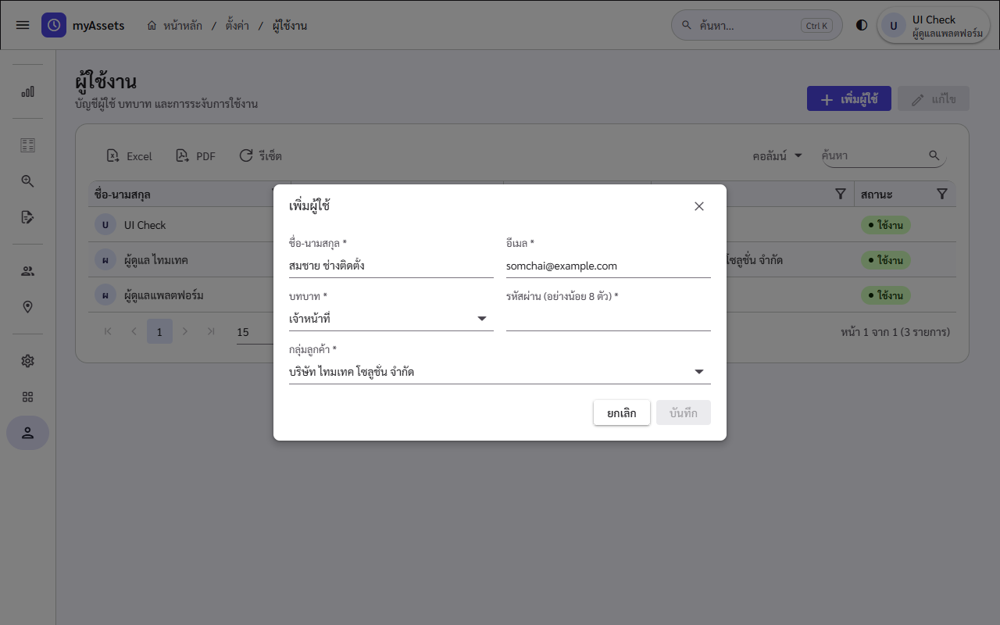

### 11.5 ประวัติการแก้ไขข้อมูล (ผู้ดูแล)

เมนู **ตั้งค่า → ประวัติการแก้ไข** รวมทุกการสร้าง แก้ไข ระงับ และลบ ข้อมูลตั้งค่าและข้อมูลหลัก ได้แก่ กลุ่มลูกค้า ผู้ใช้งาน รุ่นอุปกรณ์ ผู้จำหน่าย ลูกค้า จุดติดตั้ง และรูปภาพ พร้อมเวลา ผู้ทำรายการ และจำนวนฟิลด์ที่เปลี่ยน (การเปลี่ยนแปลงของตัวอุปกรณ์อยู่ในความเคลื่อนไหวสต็อกแล้ว)

- กรองด้วยช่วงวันที่และชิปประเภทข้อมูล ตัวกรองอยู่ในลิงก์ของหน้าเหมือนหน้าความเคลื่อนไหวสต็อก
- กด 👁 เพื่อดูค่าก่อนและหลังของแต่ละฟิลด์
- ผู้ดูแลแพลตฟอร์มเห็นทุกรายการ ผู้ดูแลกลุ่มลูกค้าเห็นเฉพาะของกลุ่มตน บันทึกนี้แก้ไขหรือลบไม่ได้

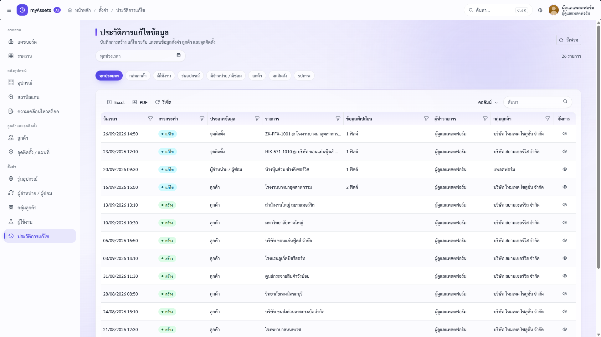

หน้าต่างดูรายละเอียด (ปุ่ม 👁) ของรายการในหน้าตั้งค่า จุดติดตั้ง และหน้ารายละเอียดลูกค้า มีส่วน "ประวัติการแก้ไข" ของรายการนั้นด้วย

## 12. รายงาน

เมนู **ภาพรวม → รายงาน** มี 2 แท็บ ทุกตารางส่งออก Excel/PDF ได้จากแถบเครื่องมือ

**ยอดคงเหลือ** — จำนวนเครื่องและต้นทุนรวม แยกตามรุ่น × กลุ่มลูกค้า × สถานะ จัดกลุ่มตามรุ่นพร้อมยอดรวมท้ายกลุ่มและท้ายตาราง ลากหัวคอลัมน์ไปวางที่แถบจัดกลุ่มเพื่อเปลี่ยนการจัดกลุ่ม (เช่น ตามกลุ่มลูกค้า) หรือกด ✕ ที่ชิปเพื่อยกเลิก ติ๊ก **รวมอุปกรณ์ที่ปลดระวาง** ถ้าต้องการนับเครื่องที่เลิกใช้แล้วด้วย

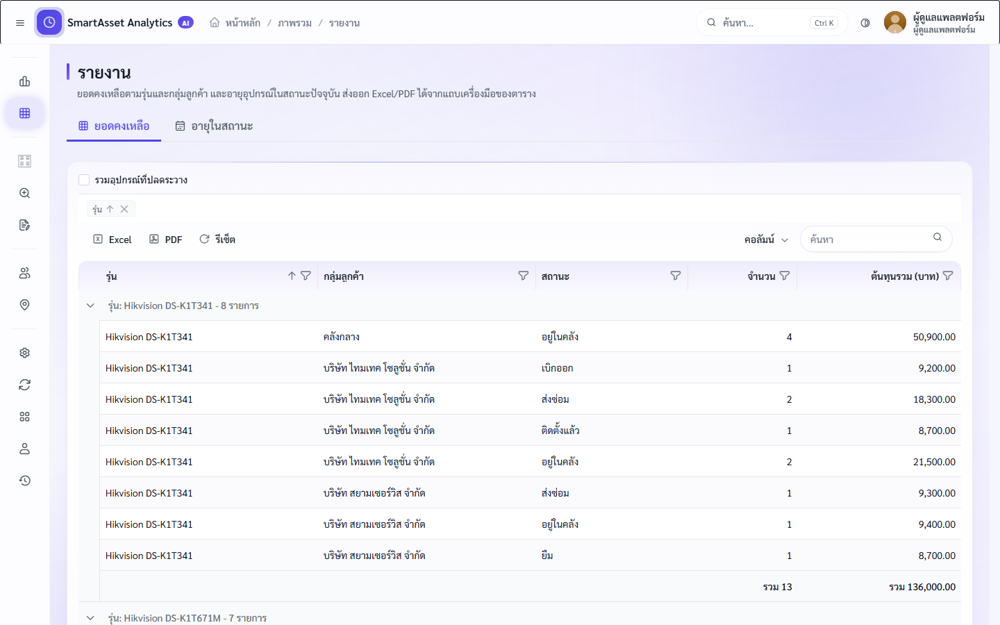

**อายุในสถานะ** — แต่ละเครื่องอยู่ในสถานะปัจจุบันมาตั้งแต่เมื่อไรและกี่วัน จัดกลุ่มตามสถานะ พร้อมจำนวนเครื่องและค่าสูงสุดของแต่ละกลุ่ม ใช้ชิปด้านบนกรองเฉพาะสถานะ เช่น ดูเครื่องที่ส่งซ่อมนานที่สุด หรือเครื่องที่ค้างอยู่ในคลังนานเกินไป

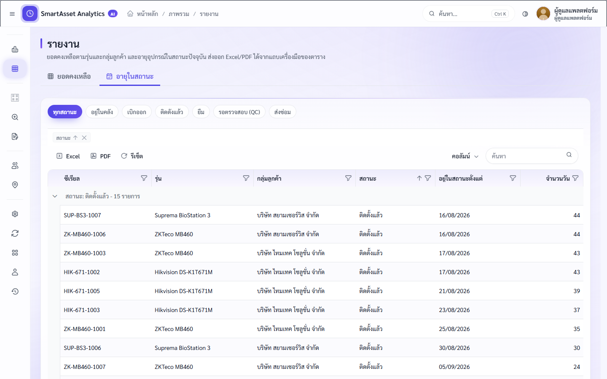

## 13. โปรไฟล์ ธีม และการใช้งานบนมือถือ

คลิกชื่อผู้ใช้มุมขวาบนเพื่อเปิดเมนู: โปรไฟล์และรหัสผ่าน, เลือกธีม (สว่าง / มืด / ตามระบบ) และออกจากระบบ ปุ่ม ◐ ข้างช่องค้นหาสลับธีมได้เร็ว

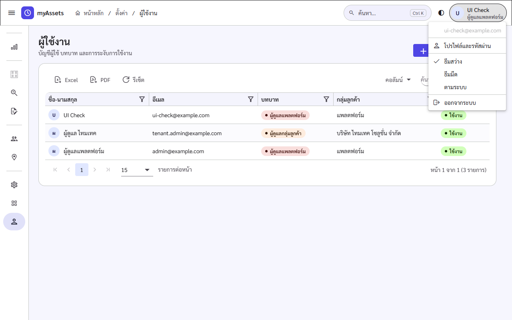

หน้าโปรไฟล์แสดงข้อมูลบัญชี เปลี่ยนธีม และเปลี่ยนรหัสผ่าน กดปุ่มรูปภาพที่มุมรูปโปรไฟล์เพื่ออัปโหลดรูปของตัวเอง (JPG, PNG, WebP ไม่เกิน 8 MB) รูปจะแสดงที่มุมขวาบนและในรายชื่อผู้ใช้ทันที และกด **ลบรูปโปรไฟล์** เพื่อกลับไปใช้อักษรแรกของชื่อ

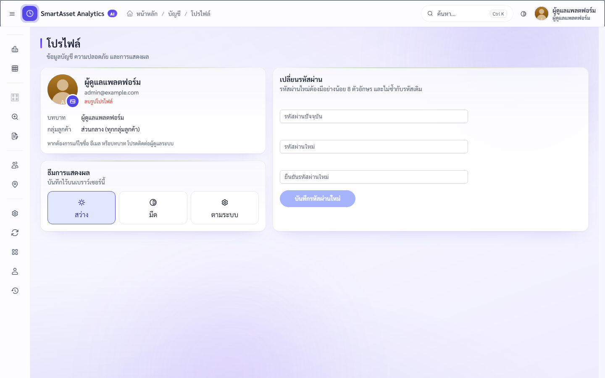

ธีมมืด

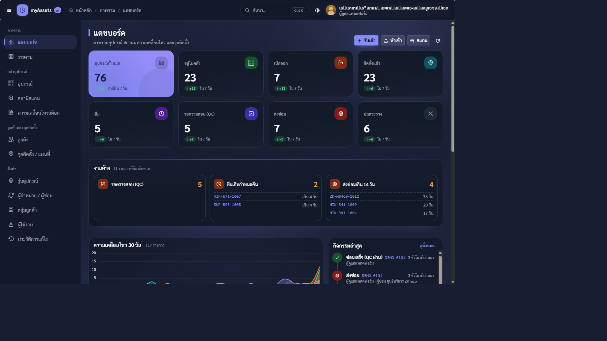

บนมือถือ การ์ดจะเรียงเป็น 2 คอลัมน์ เมนูเปิดจาก ☰ แบบลิ้นชักและปิดเองเมื่อเลือกหน้า ตารางซ่อนคอลัมน์รอง (เช่น ยี่ห้อ MAC วันที่) บนจอแคบเพื่อให้เห็นซีเรียลและสถานะ และเลื่อนซ้าย-ขวาได้

| แดชบอร์ด | เมนู | รายการอุปกรณ์ |
| --- | --- | --- |
| 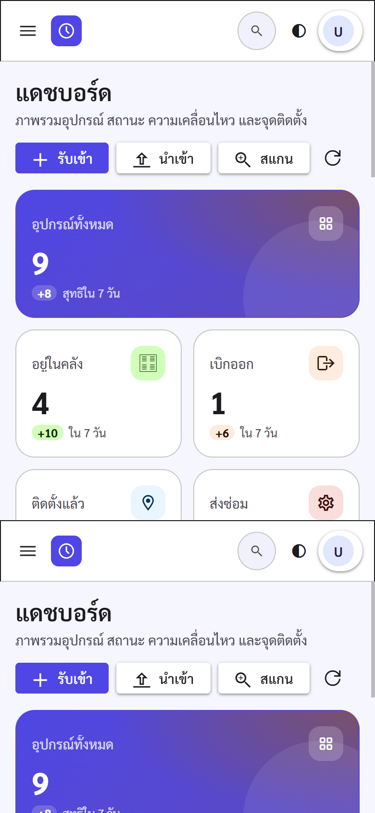 | 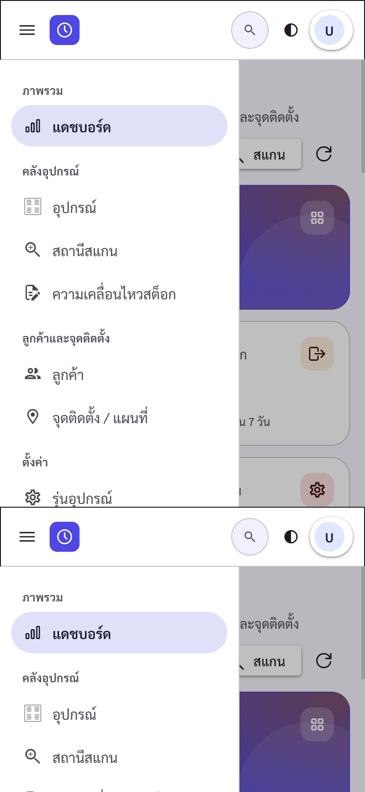 | 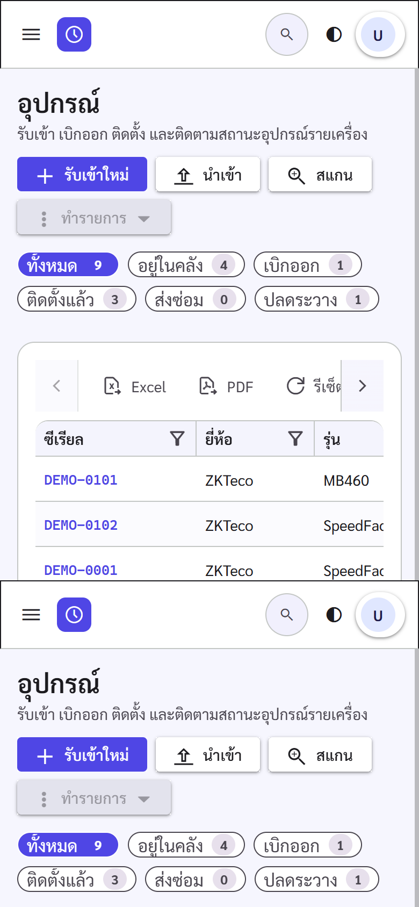 |

## 14. ข้อมูลตัวอย่างสำหรับทดลองใช้

ผู้ดูแลระบบโหลดข้อมูลสาธิตได้ด้วยคำสั่ง `docker compose exec api python -m app.infrastructure.demo_data` (รายละเอียดใน README ของโปรเจกต์) เหมาะกับการอบรมหรือทดลองใช้ก่อนใส่ข้อมูลจริง ชุดข้อมูลประกอบด้วย

- กลุ่มลูกค้า 2 กลุ่ม ลูกค้าประมาณ 11 ราย จุดติดตั้งกระจายทั่วประเทศ และผู้ใช้ทุกบทบาท
- รุ่นอุปกรณ์ 6 รุ่นพร้อมรูปสินค้า ผู้จำหน่าย/ผู้ซ่อม 4 ราย และอุปกรณ์ราว 70 เครื่องครบทุกสถานะ
- ประวัติย้อนหลัง 90 วันในเวลาทำการ ทั้งติดตั้ง รับคืน ส่งซ่อม ให้ยืม และ QC พร้อมรูปหน้างานและรูปประกอบรายการ รวมถึงเครื่องที่ยืมเกินกำหนด ส่งซ่อมนาน และประกันใกล้หมด เพื่อให้แผงงานค้างและรายงานมีข้อมูลให้ดู

รันซ้ำได้โดยไม่สร้างข้อมูลซ้ำ ข้อมูลตัวอย่างใช้ชื่อและเบอร์โทรสมมติทั้งหมด ผู้ใช้ตัวอย่างใช้รหัสผ่านเดียวกับบัญชีผู้ดูแลเริ่มต้น จึงห้ามโหลดบนระบบจริง

---

## 15. ผลตรวจ UX/UI ระหว่างทำคู่มือ

### แก้ไขแล้ว

| ปัญหา | การแก้ไข |
| --- | --- |
| ช่องหมายเหตุ (textarea) ในทุกฟอร์มกว้างแค่ราว 20 ตัวอักษร | ขยายให้เต็มคอลัมน์ฟอร์ม (`styles.scss`) |
| เมนูย่อแล้วแต่เนื้อหาเลื่อนไปอยู่ใต้เมนู หลังออกจากหน้าอุปกรณ์ | ย้ายระยะขอบเนื้อหามาคุมด้วย CSS ของ shell เอง (`shell.scss`) |
| เมนูเปิดค้างกว้าง 256px ทั้งที่สถานะเป็น "ย่อ" เมื่อหน้าต่างเปลี่ยนขนาด | เปลี่ยน Sidebar จากแบบ `Auto` เป็น `Push`/`Over` (`shell.html`) ลิ้นชักบนมือถือจึงไม่เด้งเปิดเองด้วย |
| ข้อความอังกฤษหลงเหลือ "Columns", "(1 item)" | เพิ่มคำแปลใน `locale.ts` |
| หัวข้อเชิงเทคนิค "(PostGIS ST_DWithin)" ในหน้าจุดติดตั้ง | เปลี่ยนเป็น "ค้นหาอุปกรณ์ในรัศมี" |
| คำอธิบายหน้ากลุ่มลูกค้าไม่ชัด | เขียนใหม่ให้บอกว่าแต่ละกลุ่มเห็นเฉพาะข้อมูลของตน |
| โอนอุปกรณ์: รายการปลายทางมี "คลังกลาง" แม้เครื่องอยู่คลังกลางอยู่แล้ว | ไม่แสดงตำแหน่งปัจจุบันของเครื่องในรายการปลายทาง |
| นำเข้า: checkbox "แสดงเฉพาะแถวที่ผิด" เป็นสีม่วงของ Syncfusion ไม่ตรงสีแบรนด์ | ใช้สี primary ของธีม (`accent-color`) |
| นำเข้า: ปุ่มที่ถูกปิดยังเขียน "นำเข้า 2 เครื่อง" | เปลี่ยนเป็น "แก้ไขแถวที่ผิดก่อน" พร้อม tooltip บอกเหตุผล |
| ความเคลื่อนไหวสต็อก: คอลัมน์ "รายการ" เป็นข้อความธรรมดาและถูกตัดคำ | แสดงเป็นชิปสีพร้อมไอคอนแบบเดียวกับไทม์ไลน์ และขยายความกว้างคอลัมน์ |
| แดชบอร์ดเมื่อกางเมนูเต็ม: การ์ด "อุปกรณ์ทั้งหมด" ถูกตัดคำ และ legend กราฟโดนัทแบ่งหน้า | จำนวนคอลัมน์ของการ์ดปรับตามพื้นที่เนื้อหาจริง (container query) และย้าย legend ไปด้านล่างโดยไม่แบ่งหน้า |
| แผงรายละเอียดอุปกรณ์: ปุ่ม "แก้ไข" ตกไปบรรทัดใหม่เมื่อมีหลายปุ่ม | ย้ายเป็นปุ่มไอคอน ✎ ที่หัวแผง ข้างปุ่มคัดลอกลิงก์ |
| มือถือ: ตารางอุปกรณ์เห็นแค่ ซีเรียล/ยี่ห้อ/รุ่น ต้องเลื่อนขวาเพื่อดูสถานะ | ซ่อนคอลัมน์รองบนจอแคบกว่า 768px (`hideAtMedia` ใน `app-data-grid`) |
| แดชบอร์ด: การ์ดสถานะและกิจกรรมล่าสุดคลิกไม่ได้ | คลิกการ์ดไปหน้าอุปกรณ์ที่กรองสถานะนั้น และคลิกซีเรียลเปิดรายละเอียดเครื่อง |
| ภาพ `14-repair-done-required` และ `15-repair-done` ถ่ายก่อนแก้ความกว้าง textarea | ถ่ายใหม่พร้อมภาพหน้าจออื่นที่เปลี่ยน |
| พิมพ์ฉลาก: ตัวอย่างและหน้าพิมพ์มีแต่ข้อความ ไม่มี QR และบาร์โค้ด | ตัวสร้าง QR/บาร์โค้ดวัดขนาดจากกล่องที่ถูกซ่อนไว้จึงได้ขนาด 0 ให้แสดงตัวอย่างหลังเปิดไดอะล็อก วางส่วนพิมพ์ไว้นอกจอแทนการซ่อน และแก้ค่าระดับแก้ข้อผิดพลาดของ QR |
| หน้ารายละเอียดลูกค้า: แผนที่ซูมออกทั้งประเทศแม้จุดติดตั้งอยู่ใกล้กัน | ซูมให้พอดีกับทุกจุดติดตั้งของลูกค้า |
| ข้อมูลตัวอย่าง: ประวัติการแก้ไขมีเวลาตีสอง-ตีสาม | จัดเวลาให้อยู่ในเวลาทำการเหมือนความเคลื่อนไหวสต็อก |
| ผู้ที่ตั้งค่าเครื่องให้ "ลดการเคลื่อนไหว" เห็นหน้าเข้าสู่ระบบและไอคอนกะพริบรัว | อนิเมชันที่วนไม่รู้จบเล่นครั้งเดียวแล้วหยุดเมื่อลดการเคลื่อนไหว (`styles.scss`) |

### ข้อเสนอแนะ (ยังไม่แก้)

| ปัญหา | ข้อเสนอ |
| --- | --- |
| หน้าอุปกรณ์: ปุ่ม **ทำรายการ** บนหัวหน้าใช้งานไม่ได้จริง เพราะเลือกแถวแล้วแผงรายละเอียดจะเปิดทับพร้อมพื้นหลังบัง และเมื่อปิดแผงก็ไม่มีแถวที่เลือก | เอาปุ่มนี้ออก (ปุ่มทำรายการมีครบในแผงรายละเอียด) หรือให้ทำงานกับแถวที่ติ๊กไว้ |
| อุปกรณ์ทดสอบ (`DEMO-0001`, `DEMO-0101`, `DEMO-0102`, `GUIDE-…`) ค้างอยู่บนสุดของรายการใน DB สำหรับพัฒนา | ล้าง DB แล้วโหลดข้อมูลตัวอย่างใหม่ก่อนถ่ายภาพชุดถัดไป |
