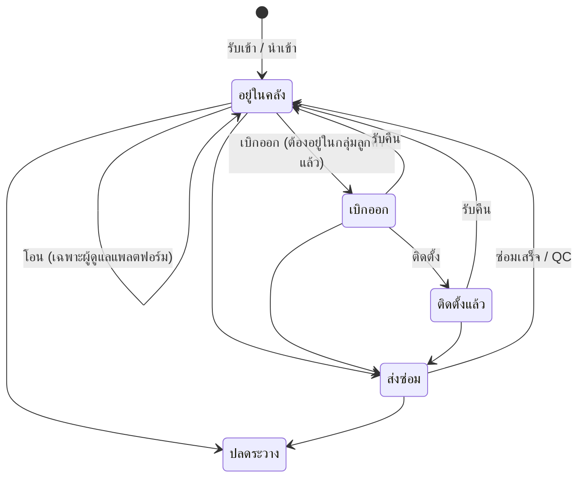

# คู่มือการใช้งาน myAssets

ระบบบริหารคลังอุปกรณ์ (เครื่องสแกนหน้า/ลายนิ้วมือ ฯลฯ) ตั้งแต่รับเข้าคลัง โอนให้กลุ่มลูกค้า เบิกออก ติดตั้งที่หน้างาน ส่งซ่อม จนถึงปลดระวาง พร้อมประวัติทุกการเคลื่อนไหว

> ภาพประกอบทั้งหมดถ่ายจากระบบจริงที่ความละเอียด 1280×800 (มือถือ 390×844) ด้วยบัญชี "ผู้ดูแลแพลตฟอร์ม" เมนูและปุ่มที่เห็นอาจน้อยกว่านี้ตามบทบาทของผู้ใช้

## สารบัญ

1. [บทบาทผู้ใช้และสถานะอุปกรณ์](#1-บทบาทผู้ใช้และสถานะอุปกรณ์)
2. [เข้าสู่ระบบและหน้าจอหลัก](#2-เข้าสู่ระบบและหน้าจอหลัก)
3. [รับอุปกรณ์เข้าคลัง](#3-รับอุปกรณ์เข้าคลัง)
4. [วงจรชีวิตอุปกรณ์: โอน → เบิก → ติดตั้ง](#4-วงจรชีวิตอุปกรณ์-โอน--เบิก--ติดตั้ง)
5. [ส่งซ่อมและบันทึกผล QC](#5-ส่งซ่อมและบันทึกผล-qc)
6. [รับคืนและปลดระวาง](#6-รับคืนและปลดระวาง)
7. [นำเข้าอุปกรณ์จากไฟล์ Excel/CSV](#7-นำเข้าอุปกรณ์จากไฟล์-excelcsv)
8. [สถานีสแกน](#8-สถานีสแกน)
9. [ความเคลื่อนไหวสต็อก](#9-ความเคลื่อนไหวสต็อก)
10. [ลูกค้าและจุดติดตั้ง/แผนที่](#10-ลูกค้าและจุดติดตั้งแผนที่)
11. [ตั้งค่า: รุ่นอุปกรณ์ กลุ่มลูกค้า ผู้ใช้งาน](#11-ตั้งค่า-รุ่นอุปกรณ์-กลุ่มลูกค้า-ผู้ใช้งาน)
12. [โปรไฟล์ ธีม และการใช้งานบนมือถือ](#12-โปรไฟล์-ธีม-และการใช้งานบนมือถือ)
13. [ผลตรวจ UX/UI ระหว่างทำคู่มือ](#13-ผลตรวจ-uxui-ระหว่างทำคู่มือ)

---

## 1. บทบาทผู้ใช้และสถานะอุปกรณ์

| บทบาท | ทำอะไรได้ |
| --- | --- |
| ผู้ดูแลแพลตฟอร์ม | เห็นทุกกลุ่มลูกค้า โอนอุปกรณ์จากคลังกลาง จัดการกลุ่มลูกค้า รุ่นอุปกรณ์ และผู้ใช้ทั้งหมด |
| ผู้ดูแลกลุ่มลูกค้า | ทำรายการกับอุปกรณ์ในกลุ่มของตน และจัดการผู้ใช้ในกลุ่ม |
| เจ้าหน้าที่ | ทำรายการกับอุปกรณ์ในกลุ่มของตน (เบิก ติดตั้ง ส่งซ่อม ฯลฯ) |
| ผู้ดูข้อมูล | ดูข้อมูลได้อย่างเดียว |

อุปกรณ์แต่ละเครื่องมี 5 สถานะ และระบบจะแสดงเฉพาะปุ่มที่ทำได้ในสถานะปัจจุบัน

## 2. เข้าสู่ระบบและหน้าจอหลัก

### 2.1 เข้าสู่ระบบ

กรอกอีเมลและรหัสผ่าน แล้วกด **เข้าสู่ระบบ**

ถ้ารหัสผ่านผิดหรือบัญชีถูกระงับ ระบบจะแจ้งเตือนด้านบนฟอร์ม

### 2.2 แดชบอร์ด

หน้าแรกหลังเข้าสู่ระบบ แสดง

- การ์ดจำนวนอุปกรณ์ตามสถานะ พร้อมตัวเลขเปลี่ยนแปลงใน 7 วัน
- กราฟความเคลื่อนไหว 30 วัน สัดส่วนตามสถานะ และจำนวนตามรุ่น
- กิจกรรมล่าสุด (กด **ดูทั้งหมด** เพื่อไปหน้าความเคลื่อนไหวสต็อก)
- ปุ่มลัด **รับเข้า**, **นำเข้า**, **สแกน** และปุ่มรีเฟรช

### 2.3 เมนูและการค้นหา

- ปุ่ม ☰ มุมซ้ายบนสลับเมนูแบบย่อ (ไอคอน) และแบบเต็ม ระบบจำค่าที่เลือกไว้

- ช่อง **ค้นหา...** ด้านบน (หรือกด `Ctrl K`) ใช้กระโดดไปหน้าต่าง ๆ หรือค้นหาอุปกรณ์ด้วยซีเรียลได้ทันที

## 3. รับอุปกรณ์เข้าคลัง

เมนู **คลังอุปกรณ์ → อุปกรณ์** แสดงรายการทุกเครื่อง ใช้ชิปด้านบน (ทั้งหมด / อยู่ในคลัง / เบิกออก / …) กรองตามสถานะ และใช้แถบเครื่องมือของตารางเพื่อส่งออก Excel/PDF เลือกคอลัมน์ หรือค้นหา

กด **รับเข้าใหม่** แล้วกรอก

- **หมายเลขซีเรียล** และ **รุ่นอุปกรณ์** (จำเป็น)
- **กลุ่มลูกค้า** — เว้นว่างไว้ถ้ารับเข้าคลังกลาง
- MAC Address, ต้นทุน, วันที่ซื้อ, วันสิ้นสุดประกัน, หมายเหตุ (ไม่บังคับ)

กด **บันทึก** เครื่องจะอยู่ในสถานะ "อยู่ในคลัง" และมีประวัติ "รับเข้า"

## 4. วงจรชีวิตอุปกรณ์: โอน → เบิก → ติดตั้ง

คลิกซีเรียลในตารางเพื่อเปิดแผงรายละเอียดด้านขวา แผงนี้แสดงข้อมูลเครื่อง สถานะประกัน ปุ่มทำรายการตามสถานะ และประวัติความเคลื่อนไหว (ปุ่ม ⧉ มุมขวาบนเปิดเป็นหน้าเต็ม)

เลือกแถวแล้วใช้เมนู **ทำรายการ** บนหัวหน้าได้เช่นกัน

### 4.1 โอนให้กลุ่มลูกค้า (ผู้ดูแลแพลตฟอร์ม)

กด **โอน** เลือก **ปลายทาง** และใส่หมายเหตุ แล้วกด **ยืนยัน**

### 4.2 เบิกออก

เมื่อเครื่องอยู่ในคลังของกลุ่มลูกค้าแล้ว กด **เบิกออก** ใส่หมายเหตุ (เช่น เบิกให้ช่างคนไหน) แล้วกด **ยืนยัน**

### 4.3 บันทึกการติดตั้ง

กด **ติดตั้ง** แล้วเลือก **ลูกค้า** วันที่ติดตั้ง และพิกัด (กด **ใช้ตำแหน่งปัจจุบัน** เมื่ออยู่หน้างานเพื่อดึงพิกัดจาก GPS) พร้อมรายละเอียดจุดติดตั้ง

หลังบันทึก สถานะเป็น "ติดตั้งแล้ว" และแผงรายละเอียดแสดงลูกค้า จุดติดตั้ง และแผนที่

เลื่อนลงเพื่อดูประวัติทั้งหมดเรียงจากล่าสุด พร้อมผู้ทำรายการและหมายเหตุ

## 5. ส่งซ่อมและบันทึกผล QC

### 5.1 ส่งซ่อม

กด **ส่งซ่อม** แล้วระบุอาการหรือสาเหตุ

### 5.2 ซ่อมเสร็จ / QC

เมื่อได้เครื่องคืนจากซ่อม กด **ซ่อมเสร็จ / QC** และกรอก **ผลการซ่อมและ QC** (จำเป็น ปุ่มยืนยันจะกดได้เมื่อกรอกแล้ว)

เครื่องจะกลับเป็น "อยู่ในคลัง" พร้อมเบิกใช้ใหม่

## 6. รับคืนและปลดระวาง

- **รับคืน** — ใช้กับเครื่องที่เบิกออกหรือติดตั้งแล้ว เพื่อนำกลับเข้าคลัง

- **ปลดระวาง** — ใช้กับเครื่องที่อยู่ในคลังหรือส่งซ่อม เมื่อเลิกใช้งานถาวร ใส่เหตุผลแล้วกดปุ่มสีแดง **ยืนยัน** เครื่องจะไม่นับรวมในสต็อก แต่ประวัติยังอยู่

## 7. นำเข้าอุปกรณ์จากไฟล์ Excel/CSV

กด **นำเข้า** ที่หน้าอุปกรณ์หรือแดชบอร์ด

**ขั้นที่ 1 — เลือกไฟล์:** ดาวน์โหลด **ไฟล์แม่แบบ .xlsx** (มีคอลัมน์ ซีเรียล, รุ่น, MAC, วันที่ซื้อ, ต้นทุน, หมดประกัน, หมายเหตุ และแท็บรายชื่อรุ่น) กรอกข้อมูล แล้วลากไฟล์มาวางหรือกด **เลือกไฟล์** (รองรับ .xlsx / .csv ไม่เกิน 2 MB และไม่เกิน 1,000 แถว)

**ขั้นที่ 2 — ตรวจสอบ:** ระบบตรวจทุกแถวก่อนบันทึก แถวที่ผิดจะแสดงเหตุผล เช่น ซีเรียลซ้ำ ไม่พบรุ่น MAC ผิดรูปแบบ ติ๊ก **แสดงเฉพาะแถวที่ผิด** เพื่อดูเฉพาะแถวที่ต้องแก้ ระบบจะนำเข้าเมื่อทุกแถวถูกต้องเท่านั้น ให้แก้ไฟล์แล้วกด **เลือกไฟล์ใหม่**

เมื่อทุกแถวผ่าน กด **นำเข้า N เครื่อง**

**ขั้นที่ 3 — เสร็จสิ้น:** ทุกเครื่องอยู่ในสถานะ "อยู่ในคลัง" และมีประวัติรับเข้า

## 8. สถานีสแกน

เมนู **คลังอุปกรณ์ → สถานีสแกน** ออกแบบสำหรับเครื่องยิงบาร์โค้ด (ทำงานแบบคีย์บอร์ด ยิงแล้วกด Enter ให้อัตโนมัติ) หรือพิมพ์ซีเรียลเอง

- พบเครื่อง: แสดงสถานะ ตำแหน่ง และปุ่มทำรายการได้ทันที กด **รายละเอียด** เพื่อเปิดหน้าเครื่อง
- ด้านขวาเก็บประวัติการสแกนของรอบนี้ (กด **ล้าง** เพื่อเริ่มใหม่)

- ไม่พบเครื่อง: แจ้งชัดเจนและมีทางลัดให้รับเข้าเป็นเครื่องใหม่ด้วยซีเรียลนั้น

## 9. ความเคลื่อนไหวสต็อก

เมนู **คลังอุปกรณ์ → ความเคลื่อนไหวสต็อก** รวมทุกรายการที่เปลี่ยนสถานะหรือย้ายอุปกรณ์ พร้อมสถานะก่อนและหลัง กลุ่มลูกค้า และลูกค้า กรอง ค้นหา และส่งออก Excel/PDF ได้

## 10. ลูกค้าและจุดติดตั้ง/แผนที่

### 10.1 ลูกค้า

เมนู **ลูกค้าและจุดติดตั้ง → ลูกค้า** จัดการบริษัทลูกค้าของแต่ละกลุ่ม พร้อมผู้ติดต่อและระดับบริการ

กด **เพิ่มลูกค้า** กรอกชื่อบริษัท กลุ่มลูกค้า ผู้ติดต่อ โทรศัพท์ อีเมล และระดับบริการ (พื้นฐาน / มาตรฐาน / พรีเมียม)

### 10.2 จุดติดตั้ง / แผนที่

แสดงทุกจุดติดตั้งบนแผนที่และในตาราง

**ค้นหาอุปกรณ์ในรัศมี:** ใส่พิกัด (หรือใช้ตำแหน่งปัจจุบัน) และระยะเป็นกิโลเมตร ระบบจะแสดงเครื่องที่อยู่ในรัศมี พร้อมระยะทาง เหมาะสำหรับวางแผนงานช่างหน้างาน

## 11. ตั้งค่า: รุ่นอุปกรณ์ กลุ่มลูกค้า ผู้ใช้งาน

### 11.1 รุ่นอุปกรณ์

รายการยี่ห้อ/รุ่น/ประเภท ที่ใช้ตอนรับเข้าและในไฟล์นำเข้า

### 11.2 กลุ่มลูกค้า (เฉพาะผู้ดูแลแพลตฟอร์ม)

องค์กรที่ใช้ระบบ แต่ละกลุ่มเห็นเฉพาะอุปกรณ์และข้อมูลของตนเอง

### 11.3 ผู้ใช้งาน

จัดการบัญชี บทบาท และการระงับใช้งาน

กด **เพิ่มผู้ใช้** กรอกชื่อ อีเมล บทบาท รหัสผ่าน (อย่างน้อย 8 ตัว) และกลุ่มลูกค้า ปุ่ม **บันทึก** จะกดได้เมื่อกรอกช่องจำเป็นครบ

## 12. โปรไฟล์ ธีม และการใช้งานบนมือถือ

คลิกชื่อผู้ใช้มุมขวาบนเพื่อเปิดเมนู: โปรไฟล์และรหัสผ่าน, เลือกธีม (สว่าง / มืด / ตามระบบ) และออกจากระบบ ปุ่ม ◐ ข้างช่องค้นหาสลับธีมได้เร็ว

หน้าโปรไฟล์แสดงข้อมูลบัญชี เปลี่ยนธีม และเปลี่ยนรหัสผ่าน

ธีมมืด

บนมือถือ การ์ดจะเรียงเป็นคอลัมน์ เมนูเปิดจาก ☰ แบบลิ้นชักและปิดเองเมื่อเลือกหน้า ตารางเลื่อนซ้าย-ขวาได้

| แดชบอร์ด | เมนู | รายการอุปกรณ์ |
| --- | --- | --- |
|  |  |  |

---

## 13. ผลตรวจ UX/UI ระหว่างทำคู่มือ

### แก้ไขแล้ว

| ปัญหา | การแก้ไข |
| --- | --- |
| ช่องหมายเหตุ (textarea) ในทุกฟอร์มกว้างแค่ราว 20 ตัวอักษร | ขยายให้เต็มคอลัมน์ฟอร์ม (`styles.scss`) |
| เมนูย่อแล้วแต่เนื้อหาเลื่อนไปอยู่ใต้เมนู หลังออกจากหน้าอุปกรณ์ | ย้ายระยะขอบเนื้อหามาคุมด้วย CSS ของ shell เอง (`shell.scss`) |
| เมนูเปิดค้างกว้าง 256px ทั้งที่สถานะเป็น "ย่อ" เมื่อหน้าต่างเปลี่ยนขนาด | เปลี่ยน Sidebar จากแบบ `Auto` เป็น `Push`/`Over` (`shell.html`) ลิ้นชักบนมือถือจึงไม่เด้งเปิดเองด้วย |
| ข้อความอังกฤษหลงเหลือ "Columns", "(1 item)" | เพิ่มคำแปลใน `locale.ts` |
| หัวข้อเชิงเทคนิค "(PostGIS ST_DWithin)" ในหน้าจุดติดตั้ง | เปลี่ยนเป็น "ค้นหาอุปกรณ์ในรัศมี" |
| คำอธิบายหน้ากลุ่มลูกค้าไม่ชัด | เขียนใหม่ให้บอกว่าแต่ละกลุ่มเห็นเฉพาะข้อมูลของตน |

### ข้อเสนอแนะ (ยังไม่แก้)

1. **โอนอุปกรณ์:** รายการปลายทางยังมี "คลังกลาง" แม้เครื่องอยู่คลังกลางอยู่แล้ว ควรซ่อนตำแหน่งปัจจุบัน
2. **นำเข้า:** checkbox "แสดงเฉพาะแถวที่ผิด" เป็นสีม่วงของ Syncfusion ไม่ตรงสี indigo ของแบรนด์
3. **นำเข้า:** ปุ่มที่ถูกปิดยังเขียน "นำเข้า 2 เครื่อง" ควรเปลี่ยนข้อความเป็น "แก้ไขแถวที่ผิดก่อน" หรือแสดง tooltip บอกเหตุผล
4. **ความเคลื่อนไหวสต็อก:** คอลัมน์ "รายการ" เป็นข้อความธรรมดาและตัดคำ "ซ่อมเสร็จ (QC …" ควรใช้ชิปพร้อมไอคอนแบบเดียวกับไทม์ไลน์
5. **แดชบอร์ดเมื่อกางเมนูเต็ม:** การ์ด "อุปกรณ์ทั้งหมด" ถูกตัดเป็น "อุปกรณ์ทั้ง…" และ legend กราฟโดนัทขึ้นหน้า 1/2 ควรให้การ์ดขึ้นบรรทัดใหม่ได้ หรือลดจำนวนคอลัมน์ในจอขนาดกลาง
6. **แผงรายละเอียดอุปกรณ์:** เมื่อมีปุ่ม 4 ปุ่ม ปุ่ม "แก้ไข" ตกไปบรรทัดใหม่ อาจย้าย "แก้ไข" ไปไว้ข้างปุ่ม ⧉ ที่หัวแผง
7. **มือถือ:** ตารางอุปกรณ์เห็นแค่ ซีเรียล/ยี่ห้อ/รุ่น ส่วนสถานะต้องเลื่อนขวา ควรแสดงแบบการ์ด หรือซ่อนคอลัมน์รองบนจอแคบ
8. **แดชบอร์ด:** การ์ดสถานะและรายการกิจกรรมล่าสุดยังคลิกไม่ได้ ผู้ใช้มักคาดหวังว่าคลิกการ์ดแล้วไปหน้าอุปกรณ์ที่กรองสถานะนั้น และคลิกซีเรียลแล้วเปิดรายละเอียดเครื่อง
9. **ภาพประกอบ** `14-repair-done-required` และ `15-repair-done` ถ่ายก่อนแก้ความกว้าง textarea ช่องกรอกในภาพจึงยังแคบ (ในระบบจริงแก้แล้ว)
